# ใบงานปฏิบัติบทที่ 6 API Integration & Networking ด้วย http Package

**วิชา** การพัฒนาซอฟต์แวร์สำหรับอุปกรณ์เคลื่อนที่ | **เครื่องมือ** Flutter, http package, Postman, Google AI Studio (Gemini API), OpenWeather API

---

## วัตถุประสงค์การเรียนรู้

เมื่อทำใบงานนี้เสร็จสิ้น ผู้เรียนจะสามารถ

1. เรียกใช้งาน Public REST API ด้วยแพ็กเกจ `http` และจัดการ `Future`/`async`/`await` ได้ถูกต้อง
2. สร้าง Model Class เพื่อแปลงข้อมูล JSON ให้เป็นอ็อบเจกต์ Dart ที่ปลอดภัยต่อชนิดข้อมูล
3. ออกแบบ UI ที่รองรับสถานะ Loading, Success และ Error ครบทุกกรณี
4. ทดสอบ API ด้วย Postman ก่อนนำไปเขียนโค้ดจริง เพื่อยืนยันโครงสร้างข้อมูลที่ได้รับ
5. ใช้ Google AI Studio (Gemini) ช่วย generate โค้ด API Client และประเมินความถูกต้องของโค้ดที่ได้ด้วยตนเอง


## สิ่งที่ต้องเตรียมก่อนเริ่ม

- ติดตั้ง Flutter SDK และ VS Code 
- โปรเจกต์ Flutter ใหม่ชื่อ `week6_api_lab` (สร้างด้วยคำสั่ง `flutter create week6_api_lab`)
- บัญชี Google AI Studio 
- สมัครบัญชี OpenWeather API แบบฟรีที่ https://openweathermap.org/api เพื่อรับ API Key ส่วนตัว **(หมายเหตุ: API Key ที่สมัครใหม่อาจใช้เวลาประมาณ 10-30 นาทีกว่าจะเริ่มใช้งานได้จริง ให้สมัครล่วงหน้าก่อนเริ่มทำใบงาน)**
- ติดตั้งโปรแกรม Postman (Desktop App หรือใช้งานผ่านเว็บที่ https://www.postman.com)

⚠️ **ข้อควรระวังเรื่องความปลอดภัย**: ห้าม commit API Key ของตัวเองขึ้น GitHub หรือแนบส่งในรายงานสาธารณะเด็ดขาด ให้เก็บ API Key ไว้ในไฟล์ที่ไม่ถูก track (เช่นใช้ตัวแปรใน `--dart-define` หรือไฟล์ `.env` ที่เพิ่มใน `.gitignore`) หากทำใบงานนี้ส่งอาจารย์ ให้แทนที่ Key จริงด้วยข้อความ `YOUR_API_KEY` ในภาพหน้าจอที่แนบส่ง

---

## ทฤษฎีที่จำเป็นก่อนการทดลอง
### เครือข่ายและ REST API 

แอปที่จะสร้างในใบงานนี้เป็น **Client** ที่ต้องคุยกับ **เซิร์ฟเวอร์ (Server)** ผ่านโปรโตคอล HTTP โดยยึดหลัก REST คือมอง "สภาพอากาศของเมืองหนึ่ง" หรือ "สินค้าชิ้นหนึ่ง" เป็น **Resource** ที่มี URL เฉพาะของตัวเอง การกระทำกับ Resource นั้นบอกผ่าน **HTTP Method**: `GET` ใช้ขอข้อมูลโดยไม่เปลี่ยนแปลงอะไรบนเซิร์ฟเวอร์ , `POST` ใช้สร้างข้อมูลใหม่ , และ `PUT` ใช้แก้ไขข้อมูลที่มีอยู่แล้วทั้งก้อน  ทุกครั้งที่เซิร์ฟเวอร์ตอบกลับจะแนบ **Status Code** 3 หลักมาด้วยเสมอ ตัวเลขที่จะเจอบ่อยในใบงานนี้คือ `200` (สำเร็จ), `201` (สร้างข้อมูลใหม่สำเร็จ), `404` (ไม่พบ Resource ที่ขอ) และ `500` (เซิร์ฟเวอร์มีปัญหาภายใน)

### Asynchronous Programming: Future, async และ await

การเรียก API ทุกครั้งใช้เวลา (รอเครือข่ายตอบกลับ) จึงต้องเขียนแบบ **Asynchronous** เสมอ ไม่เช่นนั้นแอปจะค้างระหว่างรอ ฟังก์ชันที่เรียก API จะมีชนิดคืนค่าเป็น `Future<...>` และต้องประกาศฟังก์ชันด้วยคำว่า `async` แล้วใช้ `await` หน้าคำสั่งที่ต้องรอผลลัพธ์ก่อนเดินหน้าต่อ (เช่น `await http.get(...)`) รูปแบบนี้จะปรากฏในแทบทุกโค้ดของใบงานนี้ ตั้งแต่ `WeatherService` ไปจนถึง `ItemRepositoryApi`

### JSON Parsing และการ Cast ชนิดข้อมูล

ข้อมูลที่ได้จากเซิร์ฟเวอร์มาเป็น **String** ข้อความดิบ ต้องแปลงผ่าน `jsonDecode()` ก่อนใช้งาน แล้วดึงค่าจาก `Map<String, dynamic>` ไปสร้างเป็น Model Class ผ่าน `factory Weather.fromJson(...)` เพื่อความปลอดภัยด้านชนิดข้อมูล ตัวเลขทุกตัวต้อง cast ผ่าน `num` ก่อนแล้วค่อยเรียก `.toDouble()` เสมอ เพราะ JSON ไม่แยก int กับ double เคร่งครัดเหมือน Dart

 JSON จริงที่ได้จาก OpenWeather API  มีโครงสร้างซ้อนกัน 2 ชั้น ไม่ใช่ระดับเดียวเหมือนตัวอย่าง `weather.json` ในบทเรียน — อุณหภูมิอยู่ใน object ย่อยชื่อ `main` (เช่น `json['main']['temp']`) และคำอธิบายสภาพอากาศอยู่ใน `weather` ซึ่งเป็น **List** ไม่ใช่ Object เดี่ยว (ต้อง cast เป็น `List<dynamic>` แล้วดึงสมาชิกตัวแรกออกมาก่อนจึงจะเข้าถึง `description` ได้) จุดนี้คือสิ่งที่ทำให้การ parse JSON ในโลกจริงยากกว่าตัวอย่างในห้องเรียนเล็กน้อยเสมอ ให้สังเกตโครงสร้างนี้ให้ดีตอนทดสอบด้วย Postman ในส่วนที่ 1 ก่อนลงมือเขียน Model Class ในส่วนที่ 2

### การจัดการข้อผิดพลาด

การเรียก API ที่ดีต้องครอบด้วย `try-catch` และตั้ง `.timeout()` เสมอ เพื่อไม่ให้แอปแบบไม่มีที่สิ้นสุดเมื่อสัญญาณอินเทอร์เน็ตมีปัญหา ข้อผิดพลาดที่พบบ่อยและใบงานนี้จะให้ฝึกดักจับคือ `TimeoutException` (รอเกินเวลาที่กำหนด), `http.ClientException` (เชื่อมต่อเซิร์ฟเวอร์ไม่ได้เลย เช่น ไม่มีอินเทอร์เน็ต) และ `FormatException` (ข้อมูลที่ได้กลับมาไม่ใช่ JSON ที่ถูกต้อง) โดยหลักการคือต้องแปลง error จากระบบให้เป็นข้อความภาษาไทยที่ผู้ใช้อ่านเข้าใจได้เสมอ ไม่ใช่โยน error message ขึ้นหน้าจอตรง ๆ

### Repository Pattern

ส่วนที่ 7 ของใบงานนี้จะใช้หลักการ Repository Pattern ที่เรียนไปแล้วในสัปดาห์ที่ 4 โดยแยก **Interface** (บอกว่า "ทำอะไร" เช่น `abstract class ItemRepository { Future<List<Item>> getItems(); }`) ออกจาก **Implementation** (บอกว่า "ทำอย่างไร" เช่นไปดึงจาก REST API จริง) เพื่อให้ Widget/หน้าจอรู้จักแค่ Interface เท่านั้น ทำให้สามารถสลับแหล่งข้อมูล (เช่น จาก REST API ไปเป็น Firestore) ได้โดยไม่ต้องแก้โค้ดฝั่ง UI เลย

### เครื่องมือและ API ที่ใช้จริงในใบงานนี้

- **Postman** คือโปรแกรมสำหรับยิง HTTP Request ทดสอบโดยไม่ต้องเขียนโค้ด ใช้ยืนยันว่า Endpoint ทำงานถูกต้องและดูโครงสร้าง JSON จริงก่อนเขียนโค้ด Flutter เสมอ (หลักปฏิบัติมาตรฐานของนักพัฒนามืออาชีพ)
- **OpenWeather API** (`api.openweathermap.org`) คือ Public REST API ให้ข้อมูลสภาพอากาศจริง ใช้ในส่วนที่ 1-2 ของใบงานนี้ ต้องสมัครรับ API Key ฟรีก่อนใช้งาน
- **JSONPlaceholder** (`jsonplaceholder.typicode.com`) คือ Fake REST API ฟรีที่สร้างไว้ให้นักพัฒนาทดสอบ POST/PUT/DELETE โดยไม่มีฐานข้อมูลจริงอยู่เบื้องหลัง (ข้อมูลที่ส่งไปจะไม่ถูกบันทึกจริง แต่เซิร์ฟเวอร์จะ "แสร้ง" ตอบกลับเหมือนบันทึกสำเร็จ) ใช้ฝึก HTTP Method อื่นนอกจาก GET ในส่วนที่ 3
- **Fake Store API** (`fakestoreapi.com`) คือ Public API ฟรีอีกตัวที่จำลองข้อมูลร้านค้า/สินค้า ใช้เป็นแหล่งข้อมูลของโปรเจกต์หลัก Campus Marketplace ในส่วนที่ 7 ก่อนที่จะย้ายไปใช้ Firebase จริงในสัปดาห์ถัดไป
- **Google AI Studio / Gemini API** ใช้ในส่วนที่ 4 เป็นผู้ช่วยร่าง (generate) โค้ด API Client เบื้องต้น แต่ผู้เรียนยังต้องตรวจสอบความถูกต้องด้วยตนเองเสมอ (ดูคำเตือนท้ายส่วนที่ 4)
- **แพ็กเกจ `http` เทียบกับ `dio`** — `http` (ที่ใช้หลักในใบงานนี้) เป็นแพ็กเกจพื้นฐานที่ทางการของ Flutter ดูแล ส่วน `dio` (ที่ทดลองในส่วนที่ 5) เป็นแพ็กเกจของ Community ที่มีลูกเล่นเพิ่มเติม เช่น แปลง JSON ให้อัตโนมัติและมีระบบ Interceptor ทั้งสองแพ็กเกจใช้หลักการ REST/Future/async เดียวกันทุกประการ ต่างกันแค่ syntax และลูกเล่นที่ห่อไว้ให้

---

## ส่วนที่ 1: ทดสอบ API ด้วย Postman ก่อนเขียนโค้ด

ก่อนเขียนโค้ด Flutter **นักพัฒนามืออาชีพจะทดสอบ API ด้วยเครื่องมือภายนอกก่อนเสมอ** เพื่อยืนยันว่า Endpoint ทำงานถูกต้องและรู้โครงสร้าง JSON ที่แท้จริงที่จะได้รับกลับมา

### ขั้นตอนที่ 1.1 — 🔧 ทำตามขั้นตอน

เปิด Postman แล้วสร้าง Request ใหม่ ตั้งค่า Method เป็น `GET` และใส่ URL ต่อไปนี้ (แทนที่ `YOUR_API_KEY` ด้วย Key จริงของนักศึกษา ที่ได้จากการสมัครสมาชิกของเว็บนี้)

```
https://api.openweathermap.org/data/2.5/weather?q=Bangkok&appid=YOUR_API_KEY&units=metric&lang=th
```

กด **Send** แล้วสังเกตผลลัพธ์สองส่วนคือ **Status Code** ที่แสดงมุมขวาบน และ **Response Body** ที่เป็น JSON ด้านล่าง

> ✅ **Checkpoint 1.1** ถ่ายภาพหน้าจอ Postman ที่แสดง Status Code `200` พร้อม Response Body แบบเต็ม จากนั้นให้เขียนระบุใน ว่า key ใดใน JSON ที่คาดว่าจะต้องใช้แสดงผลในแอป (เช่น ชื่อเมือง, อุณหภูมิ, คำอธิบายสภาพอากาศ)

ใช้ Postman Web แทนที่ `appid` ด้วยตัวแปร Global `{{apiKey}}` เพื่อไม่ให้ Key จริงปรากฏในภาพหน้าจอ

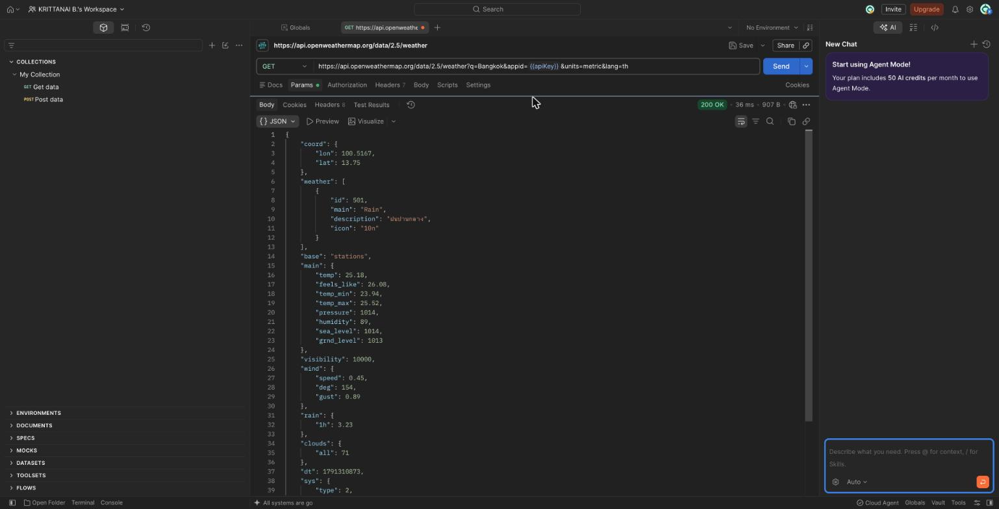

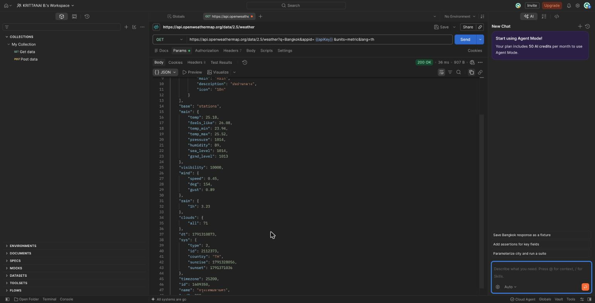

ได้ Status Code `200 OK` key ที่คาดว่าต้องใช้แสดงผลในแอป

| ข้อมูล | key ใน JSON | ค่าที่ได้ | หมายเหตุ |
|---|---|---|---|
| ชื่อเมือง | `name` | `กรุงเทพมหานคร` | อยู่ระดับบนสุด (ได้ภาษาไทยเพราะใส่ `lang=th`) |
| อุณหภูมิ | `main.temp` | `25.18` | ซ้อนอยู่ใน object `main` |
| อุณหภูมิที่รู้สึกได้ | `main.feels_like` | `26.08` | ซ้อนอยู่ใน object `main` |
| คำอธิบายสภาพอากาศ | `weather[0].description` | `ฝนปานกลาง` | `weather` เป็น **List** ต้องดึงสมาชิกตัวแรกก่อน |

key อื่นที่อาจใช้ต่อได้ เช่น `main.humidity` (ความชื้น), `wind.speed` (ความเร็วลม) และ `weather[0].icon` (รหัสไอคอน)
### ขั้นตอนที่ 1.2 — 🧠 คิดเอง/ออกแบบเอง

ออกแบบการทดสอบกรณีผิดพลาด (error case) อย่างน้อย 1 กรณี โดยเปลี่ยนค่าพารามิเตอร์บางตัวใน Request ให้เป็นสิ่งที่คาดว่าจะทำให้เซิร์ฟเวอร์ตอบกลับด้วย error (ตัวอย่างแนวทางที่เลือกได้ เช่น เปลี่ยนชื่อเมืองเป็นชื่อที่ไม่มีอยู่จริง, ใส่ `appid` ผิด, หรือลบ `appid` ออกไปเลย) **ก่อนกด Send ให้เขียนคาดการณ์ ก่อนว่า นักศึกษาคิดว่า Status Code จะเป็นอะไร** แล้วจึงทดสอบจริงเพื่อเทียบกับที่คาดไว้

> ✅ **Checkpoint 1.2** บันทึกด้านล่างว่านักศึกษาเลือกทดสอบกรณีใด คาดการณ์ Status Code ไว้ว่าอะไร และ Status Code จริงที่ได้คืออะไร (ตรงหรือไม่ตรงกับที่คาดไว้) พร้อมอธิบายว่าผลลัพธ์ที่ได้ตรงกับช่วง Status Code ใดตามตารางในบทเรียนหัวข้อ 6.3

**กรณีที่เลือกทดสอบ:** เปลี่ยนชื่อเมืองเป็นชื่อที่ไม่มีอยู่จริง `q=Atlantisxyz` (พารามิเตอร์อื่นเหมือนเดิม)

**คาดการณ์ก่อนกด Send:** `404 Not Found` เพราะ URL และ API Key ถูกต้อง แต่ Resource ที่ขอ (เมือง Atlantisxyz) ไม่มีอยู่บนเซิร์ฟเวอร์

**ผลจริง:** `404 Not Found` พร้อม body `{"cod": "404", "message": "city not found"}` — **ตรงกับที่คาดไว้**

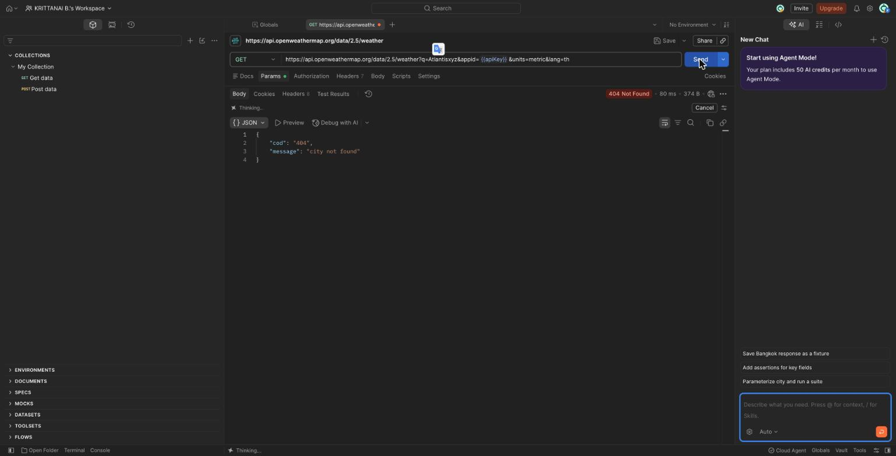

ผลนี้อยู่ในช่วง **4xx (Client Error)** ตามตารางหัวข้อ 6.3 คือฝั่ง Client ขอสิ่งที่ผิดเอง (ขอเมืองที่ไม่มีอยู่จริง) ไม่ใช่เซิร์ฟเวอร์มีปัญหา (ซึ่งจะเป็น 5xx) แอปจึงควรบอกผู้ใช้ให้ตรวจสอบการสะกดชื่อเมือง แทนที่จะบอกให้ลองใหม่ภายหลัง

นอกจากนี้ช่วงแรกที่สมัคร Key ใหม่ ยังเจอ `401 Unauthorized` (`Invalid API key`) ซึ่งก็อยู่ในช่วง 4xx เช่นกัน เพราะ Key ยังไม่เปิดใช้งาน (OpenWeather ใช้เวลาเปิดใช้งาน Key ใหม่ประมาณ 10 นาทีถึง 2 ชั่วโมง)
---

## ส่วนที่ 2: สร้าง Model Class และเรียก API ด้วย http Package

### ขั้นตอนที่ 2.1 — 🔧 ทำตามขั้นตอน

เพิ่ม dependency ในไฟล์ `pubspec.yaml`

```yaml
dependencies:
  flutter:
    sdk: flutter
  http: ^1.2.2
```

รันคำสั่งในเทอร์มินัลของ VS Code

```bash
flutter pub get
```

### ขั้นตอนที่ 2.2 — 🧠 คิดเอง/ออกแบบเอง

สร้างไฟล์ `lib/models/weather.dart` แล้วเขียน `Weather` model ให้ครบเองตามโครง (scaffold) ด้านล่าง โดยอ้างอิงโครงสร้าง JSON จริงที่เห็นจาก Postman ในส่วนที่ 1

```dart
class Weather {
  final String cityName;
  final double temperature;
  final String description;
  final double feelsLike;

  const Weather({
    required this.cityName,
    required this.temperature,
    required this.description,
    required this.feelsLike,
  });

  factory Weather.fromJson(Map<String, dynamic> json) {
    // ตัวอย่าง: ดึงค่าจาก object ย่อย 'main' ออกมาก่อน (ต้อง cast เป็น Map<String, dynamic>)
    // และ cast ตัวเลขผ่าน num ก่อนเรียก .toDouble() เสมอ
    final main = json['main'] as Map<String, dynamic>;
    final temperature = (main['temp'] as num).toDouble();

    // TODO: ดึง feels_like จาก main ด้วยวิธีเดียวกับ temperature ด้านบน
    // TODO: cast json['weather'] เป็น List<dynamic> แล้วดึงสมาชิกตัวแรกออกมาเป็น
    //       Map<String, dynamic> เพื่อดึงค่า description
    // TODO: ดึง cityName จาก key 'name' ที่ระดับบนสุดของ json
    // TODO: return Weather(...) โดยใส่ค่าทั้ง 4 ฟิลด์ที่ดึงมาได้ให้ครบ
  }
}
```

**สิ่งที่ต้องสังเกตจาก JSON จริง (ไม่เหมือนตัวอย่าง Flat JSON ในบทเรียนหัวข้อ 6.5):** อุณหภูมิและ feels-like ไม่ได้อยู่ที่ระดับบนสุดของ JSON แต่ซ้อนอยู่ใน object ย่อยชื่อ `main` ส่วนคำอธิบายสภาพอากาศอยู่ใน `weather` ซึ่งเป็น **List** ไม่ใช่ Object เดี่ยว (ต้องดึงสมาชิกตัวแรกออกมาก่อน)

เกณฑ์ที่ `fromJson` ของนักศึกษาที่ต้องทำให้ครบ

- cast `json['main']` เป็น `Map<String, dynamic>` ก่อนดึง `temp` และ `feels_like`
- cast `json['weather']` เป็น `List<dynamic>` แล้วดึงสมาชิกตัวแรกออกมาเป็น `Map<String, dynamic>` ก่อนดึง `description`
- ตัวเลขทุกตัวต้อง cast ผ่าน `num` แล้วเรียก `.toDouble()` เสมอ 
- `cityName` ดึงจาก key `name` ที่ระดับบนสุดของ JSON

**ก่อนถึง Checkpoint ด้านล่าง ให้สร้างไฟล์ใหม่แยกต่างหาก** เช่น `lib/test_weather_parse.dart` (ไม่ต้องปนกับ `main.dart` หลักของแอป) แล้วเขียนโค้ดทดสอบตามตัวอย่างด้านล่าง โดยแทนที่ `rawJson` ด้วย Response Body จริงที่คัดลอกมาจาก Postman ในขั้นตอนที่ 1.1

```dart
import 'dart:convert';
import 'models/weather.dart'; // ปรับ path ให้ตรงกับตำแหน่งไฟล์จริงในโปรเจกต์

void main() {
  // TODO: แทนที่ข้อความด้านล่างด้วย Response Body จริงที่คัดลอกมาจาก Postman ในขั้นตอนที่ 1.1
  const rawJson = '''
  {
    "name": "Bangkok",
    "main": { "temp": 32.5, "feels_like": 36.1 },
    "weather": [ { "description": "เมฆบางส่วน" } ]
  }
  ''';

  final json = jsonDecode(rawJson) as Map<String, dynamic>;
  final weather = Weather.fromJson(json);

  print('cityName: ${weather.cityName}');
  print('temperature: ${weather.temperature}');
  print('description: ${weather.description}');
  print('feelsLike: ${weather.feelsLike}');
}
```

รันไฟล์นี้แยกจากแอปหลัก — ใน VS Code เปิดไฟล์นี้แล้วกด **Run** ที่มุมขวาบน (หรือคลิกขวา > Run) หรือรันจาก terminal ด้วยคำสั่ง `dart run lib/test_weather_parse.dart` เพราะไฟล์นี้มี `main()` ของตัวเอง จึงรันแยกจากแอป Flutter หลักได้ทันทีโดยไม่ต้องเปิดโปรแกรมทั้งแอป

> ✅ **Checkpoint 2.1** รันไฟล์ทดสอบข้างต้น สังเกตค่าทั้ง 4 ฟิลด์ที่ `print()` ออกมาใน Debug Console ว่าตรงกับ Response Body จริงจาก Postman หรือไม่ ถ่ายภาพหน้าจอ Debug Console ที่แสดงว่าค่าทั้ง 4 ฟิลด์ถูกต้องตรงกับ JSON จริง

ใช้ Response Body จริงจาก Postman ในขั้นตอนที่ 1.1 ทั้งก้อนเป็น `rawJson` ใน `lib/test_weather_parse.dart`

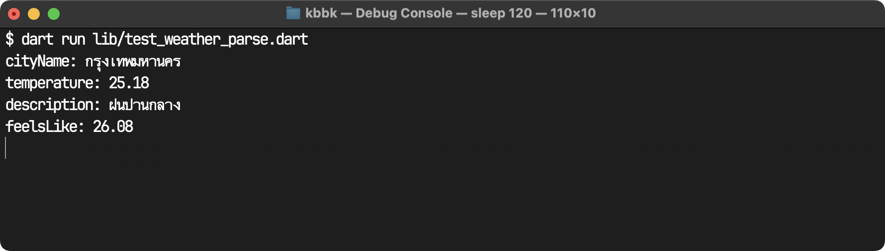

ค่าทั้ง 4 ฟิลด์ตรงกับ JSON จริงจาก Postman: `name` → `กรุงเทพมหานคร`, `main.temp` → `25.18`, `weather[0].description` → `ฝนปานกลาง`, `main.feels_like` → `26.08`

โค้ด `Weather.fromJson` ที่เขียนต่อ

```dart
  factory Weather.fromJson(Map<String, dynamic> json) {
    // อุณหภูมิและ feels_like ซ้อนอยู่ใน object ย่อย 'main'
    final main = json['main'] as Map<String, dynamic>;
    final temperature = (main['temp'] as num).toDouble();
    final feelsLike = (main['feels_like'] as num).toDouble();

    // 'weather' เป็น List ต้องดึงสมาชิกตัวแรกออกมาก่อนจึงจะเข้าถึง description ได้
    final weatherList = json['weather'] as List<dynamic>;
    final firstWeather = weatherList.first as Map<String, dynamic>;
    final description = firstWeather['description'] as String;

    // ชื่อเมืองอยู่ที่ระดับบนสุดของ JSON
    final cityName = json['name'] as String;

    return Weather(
      cityName: cityName,
      temperature: temperature,
      description: description,
      feelsLike: feelsLike,
    );
  }
```
### ขั้นตอนที่ 2.3 — 🧠 คิดเอง/ออกแบบเอง

สร้างไฟล์ `lib/services/weather_service.dart` แล้วเขียน `WeatherService` ต่อจากตัวอย่างโครงเริ่มต้นด้านล่างนี้  

```dart
import 'dart:async';
import 'dart:convert';
import 'package:http/http.dart' as http;
import '../models/weather.dart';

class WeatherService {
  static const _baseUrl = 'https://api.openweathermap.org/data/2.5/weather';
  static const _apiKey = 'YOUR_API_KEY';

  Future<Weather> fetchWeather(String city) async {
    final uri = Uri.parse('$_baseUrl?q=$city&appid=$_apiKey&units=metric&lang=th');

    try {
      final response = await http.get(uri).timeout(const Duration(seconds: 10));

      if (response.statusCode == 200) {
        // ตัวอย่าง: กรณีสำเร็จ แปลงข้อมูลด้วย Weather.fromJson
        return Weather.fromJson(jsonDecode(response.body));
      }
      // TODO: เพิ่มเงื่อนไขกรณี statusCode == 404
      // แก้ไข throw Exception ด้านล่างด้วยข้อความภาษาไทย ที่เข้าใจง่ายและเหมาะสม
      throw Exception('ผิดพลาด ${response.statusCode}');
    } on TimeoutException {
      // ตัวอย่าง: แปลง error ที่ได้จากระบบ เป็นข้อความภาษาไทยที่อ่านเข้าใจง่าย
      throw Exception('การเชื่อมต่อหมดเวลา กรุณาลองใหม่อีกครั้ง');
    } on http.ClientException {
      // ตัวอย่าง: ดักจับกรณีเชื่อมต่อเซิร์ฟเวอร์ไม่ได้เลย (เช่น ไม่มีอินเทอร์เน็ต)
      throw Exception('ไม่สามารถเชื่อมต่ออินเทอร์เน็ตได้ กรุณาตรวจสอบการเชื่อมต่อ');
    } 
       // TODO: เพิ่มการดักจับ FormatException แยกต่างหาก (on FormatException) สำหรับกรณี JSON ผิดรูปแบบ
      // แล้ว throw Exception ข้อความภาษาไทยที่อ่านเข้าใจง่าย   
    catch (e) {

      rethrow;
    }
  }
}
```


> ✅ **Checkpoint 2.2** บันทึกผลการตรวจสอบ `statusCode` อย่างน้อย 2 กรณี (สำเร็จ และ 404) ตามเกณฑ์ข้างต้น

โค้ดที่เขียนต่อใน `lib/services/weather_service.dart` (ส่วนที่เพิ่มจากโครงเริ่มต้น)

```dart
      if (response.statusCode == 200) {
        return Weather.fromJson(jsonDecode(response.body));
      }
      if (response.statusCode == 404) {
        throw Exception('ไม่พบเมือง "$city" กรุณาตรวจสอบการสะกดชื่อเมืองอีกครั้ง');
      }
      if (response.statusCode == 401) {
        throw Exception('API Key ไม่ถูกต้องหรือยังไม่เปิดใช้งาน');
      }
      throw Exception('เซิร์ฟเวอร์ตอบกลับผิดพลาด (สถานะ ${response.statusCode}) กรุณาลองใหม่ภายหลัง');
    } on TimeoutException {
      throw Exception('การเชื่อมต่อหมดเวลา กรุณาลองใหม่อีกครั้ง');
    } on http.ClientException {
      throw Exception('ไม่สามารถเชื่อมต่ออินเทอร์เน็ตได้ กรุณาตรวจสอบการเชื่อมต่อ');
    } on FormatException {
      throw Exception('ข้อมูลที่ได้รับจากเซิร์ฟเวอร์ไม่ถูกต้อง กรุณาลองใหม่อีกครั้ง');
    } catch (e) {
      rethrow;
    }
```

นอกจากนี้ยังใช้ `Uri.encodeQueryComponent(city)` ตอนต่อ URL เพื่อให้พิมพ์ชื่อเมืองที่มีช่องว่างหรือภาษาไทยได้ และเพิ่มกรณี `401` เพราะตอนสมัคร Key ใหม่ ๆ เจอจริงว่า Key ยังไม่เปิดใช้งาน

**ผลการตรวจสอบ statusCode** (log จาก `print` ใน `WeatherService` ตอนทดสอบขั้นตอนที่ 2.4)

```text
[WeatherService] GET Bangkok -> statusCode 200
[WeatherService] GET Atlantisxyz -> statusCode 404
```

| กรณี | statusCode | ผลที่แอปแสดง |
|---|---|---|
| ค้นหา `Bangkok` (มีจริง) | `200` | `กรุงเทพมหานคร: 25.18°C` ฝนปานกลาง |
| ค้นหา `Atlantisxyz` (ไม่มีจริง) | `404` | ไม่พบเมือง "Atlantisxyz" กรุณาตรวจสอบการสะกดชื่อเมืองอีกครั้ง |

### ขั้นตอนที่ 2.4 — 🧠 คิดเอง/ออกแบบเอง

สร้างไฟล์ `lib/screens/weather_search_page.dart` แล้วเขียนหน้า `WeatherSearchPage` เป็น `StatefulWidget` ที่มี `TextField` ให้ผู้ใช้พิมพ์ชื่อเมือง และปุ่มค้นหา โดยต้องจัดการ 3 สถานะให้ครบตามตัวอย่างในบทเรียนหัวข้อ 6.6 คือ

1. **กำลังโหลด** — แสดง `CircularProgressIndicator` และปิดปุ่มค้นหาไม่ให้กดซ้ำระหว่างโหลด
2. **สำเร็จ** — แสดงชื่อเมือง อุณหภูมิ และคำอธิบายสภาพอากาศ
3. **ผิดพลาด** — แสดงข้อความ error ที่อ่านเข้าใจง่าย (ไม่ใช่ error message โดยตรงจากระบบ)

โครงเริ่มต้นด้านล่างเขียนสถานะ "กำลังโหลด" และ "สำเร็จ" ไว้ให้ครบเป็นตัวอย่างที่ทำงานได้จริง (รวมถึงเรียก `WeatherService` จากขั้นตอนที่ 2.3 ใน `_search()` แล้ว) แต่ **ยังขาดสถานะ "ผิดพลาด" ที่ยังไม่สมบูรณ์อยู่ 2 จุด** (ดูคอมเมนต์ `// TODO`) — ให้คัดลอกโค้ดทั้งหมดด้านล่างไปวางในไฟล์ `lib/screens/weather_search_page.dart` ที่สร้างไว้ แล้วแก้ไขต่อจากจุดที่ขาดจนรันแล้วครบทั้ง 3 สถานะ

```dart
import 'package:flutter/material.dart';
import '../models/weather.dart';
import '../services/weather_service.dart';

enum _ViewStatus { idle, loading, success, error }

class WeatherSearchPage extends StatefulWidget {
  const WeatherSearchPage({super.key});

  @override
  State<WeatherSearchPage> createState() => _WeatherSearchPageState();
}

class _WeatherSearchPageState extends State<WeatherSearchPage> {
  final _weatherService = WeatherService();
  final _cityController = TextEditingController();

  _ViewStatus _status = _ViewStatus.idle;
  Weather? _weather;
  String? _errorMessage;

  Future<void> _search() async {
    setState(() => _status = _ViewStatus.loading);

    try {
      // ตัวอย่าง: เรียก service แล้วจัดการกรณีสำเร็จ 
      final weather = await _weatherService.fetchWeather(_cityController.text);
      setState(() {
        _weather = weather;
        _status = _ViewStatus.success;
      });
    } catch (e) {
      // TODO (จุดที่ 1): โค้ดตรงนี้ยังไม่สมบูรณ์ — ให้เพิ่ม setState จัดการกรณีเมื่อค้นหาแล้วเกิด error ให้แอปเปลี่ยนการแสดงผลจาก loading เป็นการแจ้ง error
      // 1. _status = _ViewStatus.error
      // 2. _errorMessage = ข้อความอ่านง่าย (เช่น e.toString())
   
    }
  }

  @override
  Widget build(BuildContext context) {
    return Scaffold(
      appBar: AppBar(title: const Text('ค้นหาสภาพอากาศ')),
      body: Padding(
        padding: const EdgeInsets.all(16),
        child: Column(
          crossAxisAlignment: CrossAxisAlignment.stretch,
          children: [
            TextField(
              controller: _cityController,
              decoration: const InputDecoration(labelText: 'ชื่อเมือง'),
            ),
            const SizedBox(height: 12),
            ElevatedButton(
              onPressed: _status == _ViewStatus.loading ? null : _search,
              child: const Text('ค้นหา'),
            ),
            const SizedBox(height: 16),
            // ตัวอย่าง: สถานะกำลังโหลด 
            if (_status == _ViewStatus.loading)
              const Center(child: CircularProgressIndicator()),
            // ตัวอย่าง: สถานะสำเร็จ แสดงครบทั้งชื่อเมือง อุณหภูมิ และคำอธิบาย 
            if (_status == _ViewStatus.success && _weather != null) ...[
              Text(
                '${_weather!.cityName}: ${_weather!.temperature}°C',
                style: const TextStyle(fontSize: 20, fontWeight: FontWeight.bold),
              ),
              Text(_weather!.description),
            ],
            // TODO (จุดที่ 2): ยังไม่มี UI สำหรับสถานะ error — เพิ่มเงื่อนไข เพื่อตรวจสอบสถานะ กรณี error 
            // ดูตัวอย่างวิธีการตรวจสอบสถานะ และการแสดงข้อความจากด้านบน โดยให้แสดงตัวหนังสือสีแดง

          ],
        ),
      ),
    );
  }
}
```

จากนั้นเปิดไฟล์ `lib/main.dart` แล้วตั้งให้ `WeatherSearchPage` เป็นหน้าแรกที่แอปเปิดขึ้นมา (หรือเพิ่มปุ่ม/เส้นทางไปหน้านี้จากหน้าหลักเดิมก็ได้) เช่น

```dart
import 'package:flutter/material.dart';
import 'screens/weather_search_page.dart';

void main() {
  runApp(const MyApp());
}

class MyApp extends StatelessWidget {
  const MyApp({super.key});

  @override
  Widget build(BuildContext context) {
    return const MaterialApp(
      home: WeatherSearchPage(),
    );
  }
}
```

> ✅ **Checkpoint 2.3** รันแอปแล้วทดสอบทั้ง 3 สถานการณ์ คือ (1) ค้นหาเมืองที่มีจริง (2) ค้นหาเมืองที่ไม่มีอยู่จริง (3) ปิด Wi-Fi/Data บนเครื่องแล้วลองค้นหา ถ่ายภาพหน้าจอทั้ง 3 กรณี

โค้ดที่เติมในจุดที่ 1 และ 2

```dart
    } catch (e) {
      setState(() {
        _status = _ViewStatus.error;
        // ตัดคำว่า "Exception: " ที่ Dart เติมให้อัตโนมัติออก เหลือแค่ข้อความภาษาไทย
        _errorMessage = e.toString().replaceFirst('Exception: ', '');
      });
    }
```

```dart
          if (_status == _ViewStatus.error && _errorMessage != null)
            Text(
              _errorMessage!,
              style: const TextStyle(color: Colors.red, fontSize: 16),
            ),
```

**(1) ค้นหาเมืองที่มีจริง (`Bangkok`)**

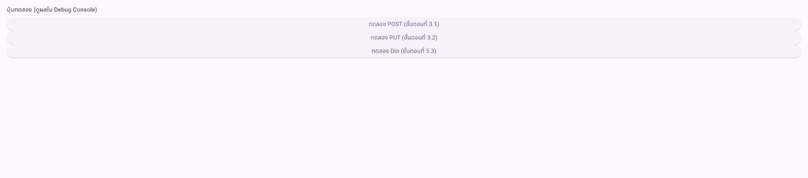

**(2) ค้นหาเมืองที่ไม่มีอยู่จริง (`Atlantisxyz`)**

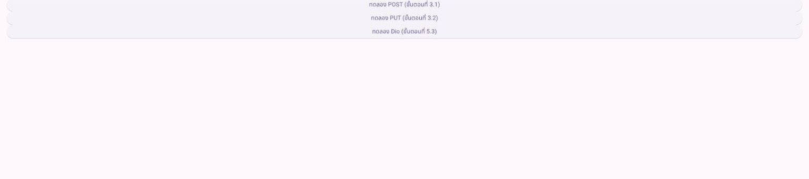

**(3) ไม่มีอินเทอร์เน็ต**

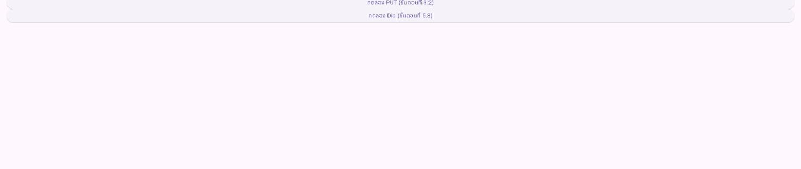

> หมายเหตุกรณีที่ 3: ทดสอบแบบ**จำลอง** ไม่ได้ปิด Wi-Fi ของเครื่องจริง โดยรันแอปบน Chrome แล้วทำให้ทุก request ที่ไป `api.openweathermap.org` ล้มเหลวแบบเดียวกับโหมด Offline ของ Chrome (`TypeError: Failed to fetch`) ซึ่งแพ็กเกจ `http` แปลงเป็น `http.ClientException` แอปจึงแสดงข้อความจากกิ่ง `on http.ClientException` ตามที่ออกแบบไว้

---

## ส่วนที่ 3: ทดลองเรียก HTTP Method อื่นนอกเหนือจาก GET

เพื่อให้เข้าใจ HTTP Methods ครบ ไม่ใช่แค่ `GET` ให้ทดลองเรียก POST และ PUT ไปยัง Public API ที่ใช้ทดสอบได้ฟรีชื่อ JSONPlaceholder

### ขั้นตอนที่ 3.1 — 🔧 ทำตามขั้นตอน

เพิ่มฟังก์ชันต่อไปนี้ในไฟล์ทดลองแยกต่างหาก (เช่น `lib/services/demo_post_service.dart`)

```dart
import 'dart:convert';
import 'package:http/http.dart' as http;

Future<void> createDemoPost() async {
  final uri = Uri.parse('https://jsonplaceholder.typicode.com/posts');

  final response = await http.post(
    uri,
    headers: {'Content-Type': 'application/json; charset=UTF-8'},
    body: jsonEncode({
      'title': 'ทดสอบส่งข้อมูลจาก Flutter',
      'body': 'นี่คือเนื้อหาที่ส่งด้วย HTTP POST',
      'userId': 1,
    }),
  );

  print('Status Code: ${response.statusCode}');
  print('Response Body: ${response.body}');
}
```

เรียกฟังก์ชันนี้จากปุ่มทดลองในหน้าจอใดก็ได้ (ใช้หน้า `WeatherSearchPage` จากขั้นตอนที่ 2.4 ที่เปิดอยู่แล้วก็ได้ ไม่ต้องสร้างหน้าใหม่) โดย import ไฟล์ `demo_post_service.dart` เข้ามา แล้วเพิ่ม `ElevatedButton` ปุ่มทดลองเข้าไปใน `Column` ของหน้านั้น เช่น

```dart
import '../services/demo_post_service.dart'; // เพิ่มบรรทัดนี้ไว้บนสุดของ weather_search_page.dart

// ... แทรกปุ่มนี้ไว้ที่ไหนก็ได้ใน children: [ ... ] ของ Column เดิม
ElevatedButton(
  onPressed: () => createDemoPost(),
  child: const Text('ทดลอง POST (ขั้นตอนที่ 3.1)'),
),
```

จากนั้นรันแอป กดปุ่มนี้ แล้วดูผลลัพธ์ใน Debug Console (ปุ่มนี้เป็นแค่ปุ่มทดลองชั่วคราว ไม่ต้องมีการจัดการ Loading/Error ใด ๆ ต่างจากปุ่ม "ค้นหา" หลักของหน้า)

> ✅ **Checkpoint 3.1** ถ่ายภาพหน้าจอ Debug Console ที่แสดง Status Code (ควรเป็น `201 Created`) พร้อม Response Body 
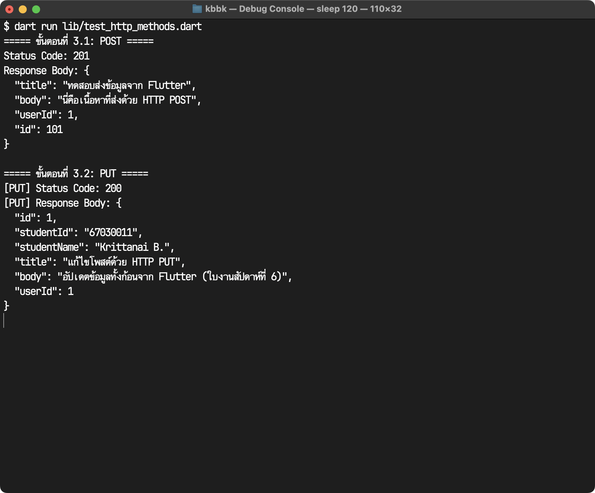

**ผลการรัน** (`dart run lib/test_http_methods.dart` ใน `week6_api_lab`)

```text
===== ขั้นตอนที่ 3.1: POST =====
Status Code: 201
Response Body: {
  "title": "ทดสอบส่งข้อมูลจาก Flutter",
  "body": "นี่คือเนื้อหาที่ส่งด้วย HTTP POST",
  "userId": 1,
  "id": 101
}
```

ได้ Status Code `201 Created` ตามที่คาดไว้ เซิร์ฟเวอร์ส่งข้อมูลที่เราส่งไปกลับมาพร้อมกำหนด `id: 101` ให้ (JSONPlaceholder มีโพสต์อยู่แล้ว 100 รายการ จึงให้ id ถัดไป แต่ไม่ได้บันทึกจริง)

### ขั้นตอนที่ 3.2 — 🧠 คิดเอง/ออกแบบเอง

เขียนฟังก์ชัน `updateDemoPost()` เพิ่มเติมด้วยตัวเอง โดยใช้ `createDemoPost()` ในขั้นตอนที่ 3.1 เป็นต้นแบบโครงสร้าง แต่เปลี่ยนให้เรียก HTTP Method **PUT** ไปยัง `https://jsonplaceholder.typicode.com/posts/1` พร้อม body ที่คุณกำหนดเนื้อหาให้มีชื่อนักศึกษา  โครงเริ่มต้นด้านล่างให้เฉพาะชื่อฟังก์ชันและ `Uri` เป็นตัวอย่าง ส่วนการเรียก `http.put()` พร้อม body และการ print ผลลัพธ์ให้เขียนต่อเอง

```dart
Future<void> updateDemoPost() async {
  final uri = Uri.parse('https://jsonplaceholder.typicode.com/posts/1');

  // ตัวอย่าง: โครงการเรียก http.put พร้อม headers (รูปแบบเดียวกับ createDemoPost ในขั้นตอนที่ 3.1)
  final response = await http.put(
    uri,
    headers: {'Content-Type': 'application/json; charset=UTF-8'},
    body: jsonEncode({
      // TODO: กำหนดเนื้อหา body เอง แต่ต้องมีข้อมูลอย่างน้อยคือ รหัส และชื่อนักศึกษา
    }),
  );

  // TODO: print statusCode และ body ออกมาเหมือนที่ทำในขั้นตอนที่ 3.1
}
```

> ✅ **Checkpoint 3.2** ถ่ายภาพหน้าจอ Debug Console ที่แสดง Status Code ของการเรียก PUT (ควรเป็น `200 OK`) 

โค้ดที่เขียนเพิ่มใน `lib/services/demo_post_service.dart`

```dart
Future<void> updateDemoPost() async {
  final uri = Uri.parse('https://jsonplaceholder.typicode.com/posts/1');

  final response = await http.put(
    uri,
    headers: {'Content-Type': 'application/json; charset=UTF-8'},
    body: jsonEncode({
      'id': 1,
      'studentId': '67030011',
      'studentName': 'Krittanai B.',
      'title': 'แก้ไขโพสต์ด้วย HTTP PUT',
      'body': 'อัปเดตข้อมูลทั้งก้อนจาก Flutter (ใบงานสัปดาห์ที่ 6)',
      'userId': 1,
    }),
  );

  print('[PUT] Status Code: ${response.statusCode}');
  print('[PUT] Response Body: ${response.body}');
}
```

**ผลการรัน**

```text
===== ขั้นตอนที่ 3.2: PUT =====
[PUT] Status Code: 200
[PUT] Response Body: {
  "id": 1,
  "studentId": "67030011",
  "studentName": "Krittanai B.",
  "title": "แก้ไขโพสต์ด้วย HTTP PUT",
  "body": "อัปเดตข้อมูลทั้งก้อนจาก Flutter (ใบงานสัปดาห์ที่ 6)",
  "userId": 1
}
```

ได้ Status Code `200 OK` (ไม่ใช่ 201 เพราะ PUT เป็นการแก้ไข Resource ที่มีอยู่แล้ว `/posts/1` ไม่ได้สร้างใหม่) และ Response Body คือข้อมูลทั้งก้อนที่ส่งไปแทนที่ของเดิม
---

## ส่วนที่ 4: ใช้ AI ช่วย Generate โค้ด API Client
### ขั้นตอนที่ 4.1 — 🔧 ทำตามขั้นตอน

เปิด Google AI Studio (https://aistudio.google.com) แล้วส่ง prompt แรกนี้ให้ Gemini — สังเกตว่า prompt นี้ระบุ API จริงที่ใช้ทดสอบได้ทันที (ไม่ใช่ API สมมติ) และระบุหลักการเขียนโค้ดที่สอดคล้องกับแบบแผนที่ใช้ตลอดทั้งใบงานนี้ (timeout, การดักจับ error 3 ชนิด, ข้อความภาษาไทย) เพื่อให้ได้โค้ดที่ใกล้เคียงมาตรฐานของใบงานมากที่สุดตั้งแต่รอบแรก

```
ฉันกำลังพัฒนาแอป Flutter ที่ต้องเรียก REST API จริงต่อไปนี้:

GET https://fakestoreapi.com/products

ตัวอย่าง Response JSON (1 รายการจากทั้งหมด):
{
  "id": 1,
  "title": "Fjallraven - Foldsack No. 1 Backpack, Fits 15 Laptops",
  "price": 109.95,
  "description": "Your perfect pack for everyday use...",
  "category": "men's clothing",
  "image": "https://fakestoreapi.com/img/81fPKd-2AYL._AC_SL1500_.jpg"
}

ช่วยเขียนโค้ด Dart (ใช้แพ็กเกจ http) ให้ครบ 3 ส่วน โดยยึดหลักการต่อไปนี้:
1. Model class ชื่อ AiProduct พร้อม factory fromJson ที่ cast ตัวเลขผ่าน num แล้วเรียก .toDouble() เสมอ
2. ฟังก์ชัน fetchAiProducts() ที่เรียก API ด้วย http package คืนค่าเป็น Future<List<AiProduct>> และตั้ง timeout ไม่เกิน 10 วินาที
3. การจัดการ error ให้ครอบคลุม TimeoutException, http.ClientException (ไม่มีอินเทอร์เน็ต) และ FormatException (JSON ผิดรูปแบบ) โดยแปลงเป็นข้อความภาษาไทยที่อ่านเข้าใจง่ายทุกกรณี ไม่ใช่ error message ที่ได้มาจากระบบโดยตรง
```

### ขั้นตอนที่ 4.2 — 🔧 ทำตามขั้นตอน

ส่ง prompt ต่อเนื่องนี้ **ในแชทเดิม** (ไม่ต้องเปิดแชทใหม่) — การพิมพ์ต่อในแชทเดิมทำให้ Gemini จำโค้ดที่เพิ่งให้ไปได้ จึงต่อยอดให้ตรงจุดโดยไม่ต้องอธิบายบริบททั้งหมดซ้ำ ซึ่งเป็นวิธีทำงานกับ AI ที่ได้ผลลัพธ์ดีกว่าการเริ่มถามใหม่ทุกครั้ง

```
ช่วยปรับโค้ดข้างต้นเพิ่มอีก 2 อย่าง:
1. เพิ่มฟังก์ชัน fetchAiProductById(int id) ที่เรียก GET https://fakestoreapi.com/products/{id} คืนค่าเป็น Future<AiProduct> รายการเดียว (ไม่ใช่ List) พร้อมจัดการ error แบบเดียวกับข้อ 3 ในคำถามก่อนหน้า
2. เขียนคอมเมนต์กำกับทุกจุดที่เกี่ยวกับการจัดการ error อธิบายว่าทำไมต้องดักจับ exception ชนิดนั้นโดยเฉพาะ
```

### ขั้นตอนที่ 4.3 — 🔧 ทำตามขั้นตอน

นำโค้ดเวอร์ชันล่าสุดจากขั้นตอนที่ 4.2 (ทั้งคลาส `AiProduct` และฟังก์ชัน `fetchAiProducts()` / `fetchAiProductById()`) ไปวางในไฟล์ใหม่ `lib/services/ai_product_service.dart` แล้ว**ทดลองเรียกใช้งานจริง** เลือกวิธีใดวิธีหนึ่งต่อไปนี้ (ใช้รูปแบบเดียวกับที่เคยทำมาแล้วในใบงานนี้)

- **แบบที่ 1**: เขียนไฟล์ทดสอบแยก เช่น `lib/test_ai_product.dart` แบบเดียวกับ Checkpoint 2.1 แต่เปลี่ยนจากการ parse JSON string คงที่ เป็นเรียก `await fetchAiProducts()` จริง แล้ว `print()` รายการสินค้าที่ได้ทั้งหมดออกมา
- **แบบที่ 2**: เพิ่มปุ่มทดลองในหน้า `WeatherSearchPage` แบบเดียวกับขั้นตอนที่ 3.1 โดยเรียก `fetchAiProducts()` แล้ว `print()` ผลลัพธ์ใน Debug Console

ไม่ว่าจะเลือกแบบไหน เป้าหมายคือต้องเห็น **ผลลัพธ์จริงจาก Fake Store API** ปรากฏขึ้นมา  ถ้ารันแล้วเจอ error หรือโค้ดจาก Gemini ผิดพลาด (เช่น import ขาด, ชื่อ field ไม่ตรงกับ JSON จริง) ให้จดบันทึกข้อความ error และวิธีแก้ไขไว้ในด้านล่าง

โค้ดที่ได้จาก Gemini 3.8 Flash ใน Google AI Studio (ส่ง prompt 4.1 และ 4.2 ต่อเนื่องในแชทเดียวกัน) นำไปวางที่ `lib/services/ai_product_service.dart` และทดสอบด้วยไฟล์ `lib/test_ai_product.dart` (แบบที่ 1)

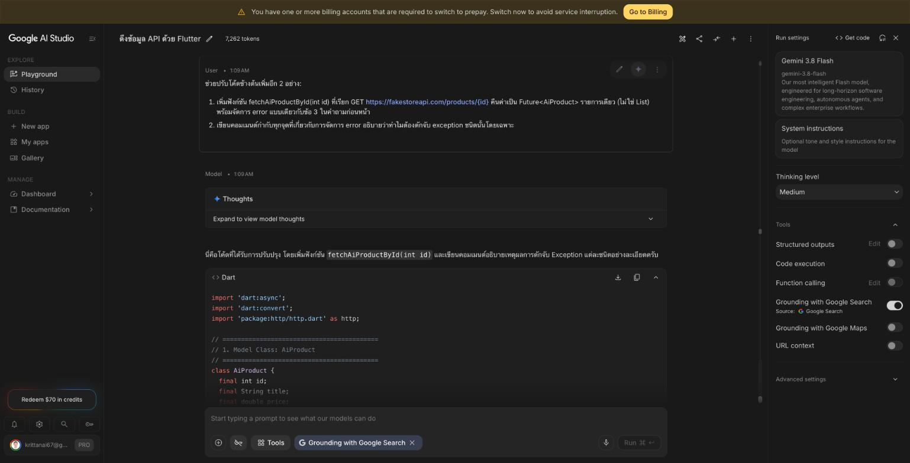

**ปัญหาที่พบและการแก้ไข**

1. **คัดลอกโค้ดจาก AI Studio ได้ไม่ครบ** — กดปุ่ม Copy ที่กล่องโค้ดแล้วได้โค้ดที่ขาดตอนที่บรรทัด `final Uri url = U` ในฟังก์ชัน `fetchAiProductById` ตอนแรกเข้าใจว่า Gemini ตอบไม่จบ จึงถามซ้ำให้ส่งโค้ดเต็มอีกครั้ง แต่สาเหตุจริงคือ AI Studio ยังแสดงโค้ดในกล่องไม่ครบ (โค้ดส่วนท้ายยังไม่ถูกแสดงบนหน้าจอ) ปุ่ม Copy จึงได้แค่ส่วนที่แสดงอยู่ **วิธีแก้:** เลื่อนให้กล่องโค้ดแสดงครบก่อนแล้วค่อยกด Copy จึงได้โค้ดครบ 137 บรรทัด
2. **รันโค้ดของ Gemini แบบไม่แก้ไขแล้วได้ข้อความ error ที่ผิดสาเหตุ** — ตอนทดสอบ `fakestoreapi.com` ล่มอยู่ (ตอบ `521`) ผลที่ได้คือ

   ```text
   fetchAiProducts() ผิดพลาด: Exception: เกิดข้อผิดพลาดที่ไม่คาดคิด กรุณาลองใหม่อีกครั้งในภายหลัง
   fetchAiProductById(1) ผิดพลาด: Exception: เกิดข้อผิดพลาดที่ไม่คาดคิด กรุณาลองใหม่อีกครั้งในภายหลัง
   ```

   ทั้งที่ควรได้ "เซิร์ฟเวอร์ขัดข้อง ไม่สามารถโหลดข้อมูลได้ในขณะนี้" สาเหตุคือ Gemini `throw Exception(...)` ไว้**ภายใน** `try` แต่ปิดท้ายด้วย `catch (e)` ที่จับทุกอย่าง ข้อความที่ตั้งใจไว้จึงถูกกลืนแล้วแทนด้วยข้อความกลาง ๆ ส่วน `fetchAiProductById` พยายามเลี่ยงปัญหานี้ด้วย `e.toString().contains('ไม่พบข้อมูลสินค้ารายการนี้')` ซึ่งเปราะบาง (ถ้าแก้ข้อความก็พัง) และยังกลืนข้อความ "เซิร์ฟเวอร์ขัดข้อง" อยู่ดี **วิธีแก้:** เพิ่ม `on Exception { rethrow; }` ก่อน `catch (e)` ทั้งสองฟังก์ชัน ให้ข้อความที่เรา throw เองผ่านออกไปได้ ส่วน `catch (e)` เหลือไว้ดักเฉพาะ Error ที่ไม่คาดคิดจริง ๆ (เช่น `TypeError` จากการ cast)
3. **Fake Store API ล่ม** — `fakestoreapi.com` ตอบ `521` ต่อเนื่องหลายชั่วโมง (6–7 ต.ค. 2026) **วิธีแก้:** เปลี่ยนไปใช้ `https://dummyjson.com/products` ซึ่งมีฟิลด์ `id`, `title`, `price`, `description`, `category` เหมือนกัน ต่างกันแค่ (ก) ห่อ List ไว้ใน key `products` และ (ข) ใช้ key `thumbnail` แทน `image` จึงแก้ให้ `fetchAiProducts` ดึง List จาก `decodedJson['products']` และ `fromJson` อ่าน `json['image'] ?? json['thumbnail']`

ทุกจุดที่แก้มีคอมเมนต์ `[แก้ไข]` กำกับไว้ในไฟล์ หลังแก้แล้วทดสอบ `fetchAiProductById(99999)` เพิ่ม ได้ข้อความ `ไม่พบข้อมูลสินค้ารายการนี้ในระบบ` ถูกต้อง ไม่ถูกกลืนเป็น "ข้อผิดพลาดที่ไม่คาดคิด" แล้ว

> ✅ **Checkpoint 4.2** ถ่ายภาพหน้าจอ Debug Console ที่แสดงผลลัพธ์จริงจากการเรียก `fetchAiProducts()` (เช่น รายการสินค้าที่ print ออกมา) 
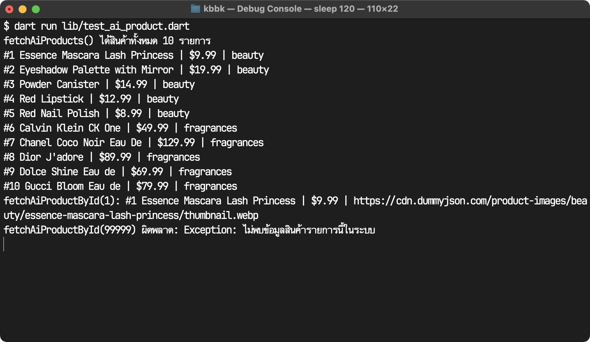

---

## ส่วนที่ 5 (เพิ่มเติม/ทดลอง): เปรียบเทียบกับ Dio Package

ส่วนนี้เป็นแบบฝึกหัดเสริมให้เห็นทางเลือกอื่นนอกจากการใช้ `http`

### ขั้นตอนที่ 5.1 — 🔧 ทำตามขั้นตอน

```yaml
dependencies:
  dio: ^5.7.0
```

รันคำสั่ง `flutter pub get` ในเทอร์มินัล

### ขั้นตอนที่ 5.2 — 🔧 ทำตามขั้นตอน

สร้างไฟล์ `lib/services/weather_service_dio.dart` แล้ววางฟังก์ชันเทียบเคียงด้วย Dio ต่อไปนี้ (แทนที่ `YOUR_API_KEY` ด้วย Key จริงของนักศึกษาก่อนใช้งาน)

```dart
import 'package:dio/dio.dart';
import '../models/weather.dart';

Future<Weather> fetchWeatherWithDio(String city) async {
  final dio = Dio(BaseOptions(
    connectTimeout: const Duration(seconds: 10),
    receiveTimeout: const Duration(seconds: 10),
  ));

  try {
    // dio แปลง JSON response.data ให้เป็น Map ให้อัตโนมัติ ไม่ต้องเรียก jsonDecode เอง
    final response = await dio.get(
      'https://api.openweathermap.org/data/2.5/weather',
      queryParameters: {'q': city, 'appid': 'YOUR_API_KEY', 'units': 'metric'},
    );
    return Weather.fromJson(response.data as Map<String, dynamic>);
  } on DioException catch (e) {
    if (e.type == DioExceptionType.connectionTimeout) {
      throw Exception('การเชื่อมต่อหมดเวลา กรุณาลองใหม่อีกครั้ง');
    }
    throw Exception('เกิดข้อผิดพลาด: ${e.message}');
  }
}
```

### ขั้นตอนที่ 5.3 — 🔧 ทำตามขั้นตอน

**ทดลองเรียกใช้งานจริง** — เลือกวิธีใดวิธีหนึ่งต่อไปนี้ (ใช้รูปแบบเดียวกับที่เคยทำมาแล้วในใบงานนี้)

- **แบบที่ 1**: เขียนไฟล์ทดสอบแยก เช่น `lib/test_weather_dio.dart` แบบเดียวกับ Checkpoint 2.1 โดยเรียก `await fetchWeatherWithDio('Bangkok')` จริง แล้ว `print()` ผลลัพธ์ทั้ง 4 ฟิลด์ออกมา
- **แบบที่ 2**: เพิ่มปุ่มทดลองในหน้า `WeatherSearchPage` แบบเดียวกับขั้นตอนที่ 3.1 โดยเรียก `fetchWeatherWithDio(_cityController.text)` แล้ว `print()` ผลลัพธ์ใน Debug Console

ระหว่างทดลอง ให้สังเกต 2 จุดนี้เป็นพิเศษ
1. ไม่ต้องเรียก `jsonDecode()` เองเหมือนตอนใช้ `http` เพราะ `dio` แปลง JSON ให้เป็น `Map` อัตโนมัติผ่าน `response.data`
2. รูปแบบการเขียน query parameters (`queryParameters: {...}`) ต่างจากการต่อ string URL เองแบบที่ทำใน `WeatherService` (ขั้นตอนที่ 2.3) 

> ✅ **Checkpoint 5.1** ถ่ายภาพหน้าจอ Debug Console ที่แสดงผลลัพธ์จริงจากการเรียก `fetchWeatherWithDio()` (ค่าทั้ง 4 ฟิลด์ของ `Weather` ที่ print ออกมา หรือแสดงผลบนหน้าจอถ้าเลือกแบบที่ 2)
ใช้แบบที่ 1: `lib/test_weather_dio.dart` (ส่ง API Key ผ่าน `-D` แทนการเขียนลงโค้ด ในภาพแทนที่ Key จริงด้วย `YOUR_API_KEY`)

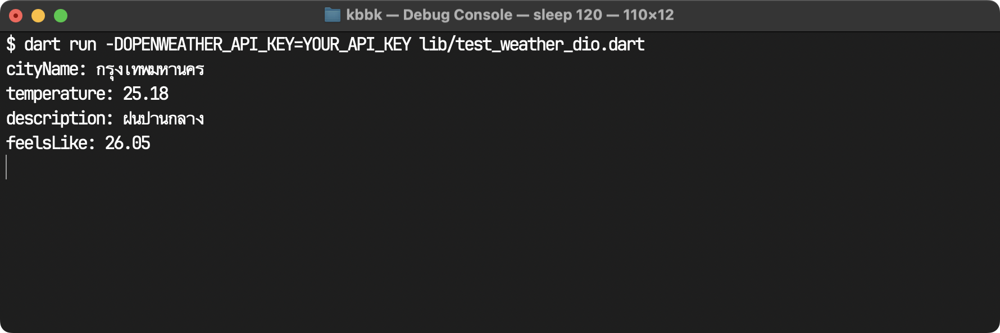
### ขั้นตอนที่ 5.4 — 🧠 คิดเอง/ออกแบบเอง

`DioException` มีหลายชนิด (`DioExceptionType`) แต่โค้ดในขั้นตอนที่ 5.2 จัดการเฉพาะ `connectionTimeout` ด้านล่างเป็นตัวอย่างการเพิ่มเงื่อนไขให้อีก 1 ชนิด (`badResponse`) ให้ดูเป็นแนวทาง จากนั้นให้เพิ่มเงื่อนไข `else if` อีกอย่างน้อย 1 ชนิดด้วยตัวเอง โดยเลือกจาก `DioExceptionType.receiveTimeout` หรือ `DioExceptionType.connectionError` (ห้ามซ้ำกับ `badResponse` ที่ให้เป็นตัวอย่างแล้ว) พร้อมข้อความแจ้งเตือนภาษาไทยที่เหมาะสมกับสาเหตุนั้นโดยเฉพาะ (ค้นคว้าความหมายของแต่ละชนิดได้จากเอกสารของแพ็กเกจ `dio` บน pub.dev)

```dart
} on DioException catch (e) {
  if (e.type == DioExceptionType.connectionTimeout) {
    throw Exception('การเชื่อมต่อหมดเวลา กรุณาลองใหม่อีกครั้ง');
  } else if (e.type == DioExceptionType.badResponse) {
    // ตัวอย่าง: เซิร์ฟเวอร์ตอบกลับมาแล้วแต่ status code ผิดพลาด (เช่น 404, 500)
    throw Exception('เซิร์ฟเวอร์ตอบกลับผิดพลาด (${e.response?.statusCode})');
  }
  // TODO: เพิ่มการจัดการ กรณี DioExceptionType.receiveTimeout และ DioExceptionType.connectionError พร้อมข้อความแจ้งเตือนภาษาไทยที่เหมาะสมกับสาเหตุนั้น
  
  throw Exception('เกิดข้อผิดพลาด: ${e.message}');
}
```

> ✅ **Checkpoint 5.2** เปรียบเทียบสั้น ๆ ระหว่าง `http` กับ `dio` อย่างน้อย 3 ประเด็น โดยอ้างอิงจากสิ่งที่สังเกตได้จริงตอนทดลองในขั้นตอนที่ 5.3 เช่น การแปลง JSON อัตโนมัติ, การกำหนด Query Parameters, และรูปแบบการจัดการ Exception (`DioException` เทียบกับการดักจับหลายชนิดแยกกันแบบ `http`)

| ประเด็น | `http` (WeatherService ขั้นตอนที่ 2.3) | `dio` (fetchWeatherWithDio ขั้นตอนที่ 5.2) |
|---|---|---|
| แปลง JSON | ต้องเรียก `jsonDecode(response.body)` เองทุกครั้ง | `response.data` เป็น `Map` มาให้แล้ว แค่ cast เป็น `Map<String, dynamic>` |
| Query Parameters | ต่อ string เอง `?q=$city&appid=...` และต้องจำไปเรียก `Uri.encodeQueryComponent(city)` เอง ไม่งั้นชื่อเมืองที่มีช่องว่าง/ภาษาไทยจะพัง | ส่งเป็น `queryParameters: {'q': city, ...}` แล้ว dio encode ให้เอง อ่านง่ายและไม่ลืม encode |
| Status code ที่ไม่ใช่ 2xx | ไม่โยน exception ต้องเช็ค `response.statusCode` เองทุกครั้ง (ถ้าลืมจะไป parse หน้า error ต่อ) | โยน `DioException` ชนิด `badResponse` ให้อัตโนมัติ |
| รูปแบบ Exception | ดักแยกหลายชนิด: `TimeoutException`, `http.ClientException`, `FormatException` | ดักชนิดเดียว `DioException` แล้วแยกสาเหตุจาก `e.type` |
| Timeout | `.timeout()` ครอบทั้ง request ค่าเดียว | แยก `connectTimeout` กับ `receiveTimeout` ได้ จึงบอกผู้ใช้ได้ละเอียดกว่าว่าต่อไม่ติดหรือเซิร์ฟเวอร์ตอบช้า |

สรุป: `dio` เขียนสั้นกว่าและจัดการเรื่องพื้นฐาน (JSON, encode, status code) ให้อัตโนมัติ ส่วน `http` ต้องเขียนเองมากกว่าแต่เห็นทุกขั้นตอนชัดเจน เหมาะกับการเรียนรู้หลักการ
>
> ✅ **Checkpoint 5.3** แสดงโค้ดเงื่อนไข `DioExceptionType` เพิ่มเติมที่เขียนเองในขั้นตอนที่ 5.4 

```dart
} on DioException catch (e) {
  if (e.type == DioExceptionType.connectionTimeout) {
    throw Exception('การเชื่อมต่อหมดเวลา กรุณาลองใหม่อีกครั้ง');
  } else if (e.type == DioExceptionType.badResponse) {
    // เซิร์ฟเวอร์ตอบกลับมาแล้วแต่ status code ผิดพลาด (เช่น 404, 500)
    throw Exception('เซิร์ฟเวอร์ตอบกลับผิดพลาด (${e.response?.statusCode})');
  } else if (e.type == DioExceptionType.receiveTimeout) {
    // เชื่อมต่อสำเร็จแล้ว แต่เซิร์ฟเวอร์ส่งข้อมูลกลับมาช้าเกินกว่า receiveTimeout ที่ตั้งไว้
    throw Exception('เซิร์ฟเวอร์ตอบกลับช้าเกินไป กรุณาลองใหม่อีกครั้งในภายหลัง');
  } else if (e.type == DioExceptionType.connectionError) {
    // เชื่อมต่อเซิร์ฟเวอร์ไม่ได้เลย เช่น ไม่มีอินเทอร์เน็ต หรือ DNS หาโดเมนไม่เจอ
    throw Exception('ไม่สามารถเชื่อมต่ออินเทอร์เน็ตได้ กรุณาตรวจสอบ Wi-Fi หรือสัญญาณมือถือ');
  }

  throw Exception('เกิดข้อผิดพลาด: ${e.message}');
}
```

- `receiveTimeout` คือเชื่อมต่อเซิร์ฟเวอร์ได้แล้ว แต่รอรับข้อมูลนานเกิน 10 วินาทีที่ตั้งไว้ใน `BaseOptions` ปัญหาจึงอยู่ที่เซิร์ฟเวอร์ช้า ข้อความจึงบอกให้ลองใหม่ภายหลัง
- `connectionError` คือเปิดการเชื่อมต่อไม่ได้ตั้งแต่ต้น (ไม่มีอินเทอร์เน็ต, DNS ล้มเหลว) ปัญหาจึงอยู่ฝั่งผู้ใช้ ข้อความจึงบอกให้ตรวจสอบ Wi-Fi/สัญญาณมือถือ
---

## ส่วนที่ 7: ต่อยอดเข้าสู่โปรเจกต์ Campus Marketplace

ส่วนนี้คือจุดที่เชื่อมความรู้ทั้งบทไปใช้กับโปรเจกต์หลักที่จะพัฒนาต่อเนื่อง **ห้ามข้ามส่วนนี้**

> 💡 **ภาพรวมก่อนเริ่มส่วนที่ 7** ส่วนนี้คือการเปลี่ยนจากข้อมูลสินค้าแบบ **mockup data** (ข้อมูลที่เขียนไว้ตายตัวในสัปดาห์ก่อนหน้านี้ เช่น `final products = [Product(...), Product(...)];`) ให้กลายเป็นข้อมูลจริงที่ดึงผ่านเครือข่ายจาก **Fake Store API** สรุปลำดับขั้นตอนและไฟล์ที่ต้องสร้างใหม่/แก้ไขมีดังนี้
>
> | ขั้นตอน | สิ่งที่ทำ | ไฟล์ที่เกี่ยวข้อง |
> |---|---|---|
> | 7.1 | เตรียมโปรเจกต์ `campus_marketplace` จากสัปดาห์ที่แล้ว | ทั้งโปรเจกต์ (เปลี่ยนชื่อโฟลเดอร์/แพ็กเกจ หรือสร้างใหม่) |
> | 7.2 | สร้าง Model ใหม่ให้ตรงกับโครงสร้าง JSON ของ Fake Store API | 🆕 สร้างใหม่ชื่อ `lib/models/item.dart` |
> | 7.3 | แยก Interface กับ Implementation สำหรับดึงข้อมูลจริงผ่าน HTTP (Repository Pattern) | 🆕 สร้างไฟล์ใหม่ชื่อ `lib/repositories/item_repository.dart`<br>🆕 สร้างไฟล์ใหม่ชื่อ `lib/repositories/item_repository_api.dart` |
> | 7.4 | เปลี่ยนหน้าจอที่เคยแสดง mock data ให้ดึงข้อมูลจริงผ่าน Repository แทน โดยยังคงปุ่ม "เพิ่มลงตะกร้า" และการไปหน้า Checkout เดิมไว้ | ✏️ แก้ไขไฟล์ `lib/screens/home_page.dart` (หรือชื่อไฟล์หน้าแสดงรายการสินค้าที่ใช้มาในสัปดาห์ก่อนหน้า)<br>✏️ แก้ไขไฟล์ จุดที่สร้าง `HomePage` ขึ้นมาจริง เช่น `lib/main.dart` (ต้องส่ง `ItemRepositoryApi()` เข้าไปทาง constructor)<br>✏️ แก้ไขไฟล์ ทุกจุดที่ยังอ้างอิง Type `Product` เดิม เช่นใน `CartModel` ต้องเปลี่ยนเป็น `Item` ให้ตรงกัน |
>
>
> **แนวคิดสำคัญที่ต้องเข้าใจก่อนลงมือปฏิบัติ** หน้าที่แสดงรายการสินค้าจากสัปดาห์ก่อนหน้า (`HomePage` หรือชื่อไฟล์ที่ใช้) ของเก่าจะมี List ของ `Product` ที่สร้างไว้ตายตัวในโค้ด ไม่ได้ดึงจากเครือข่ายเลย เป้าหมายของส่วนนี้ คือเปลี่ยน "แหล่งที่มาของข้อมูล" จากลิสต์ตายตัวนั้น ให้เป็นการเรียก `ItemRepository.getItems()` ที่ไปดึงจาก API จริงแทน โดยที่ตรรกะการทำงานฝั่ง UI เดิมจากสัปดาห์ 5 (ปุ่ม "เพิ่มลงตะกร้า" ที่เรียก `context.read<CartModel>().add(...)`, ไอคอนตะกร้าที่นับจำนวนใน AppBar, และการกดไปหน้า `CheckoutPage`) **ไม่ต้องแก้ไขตรรกะเลย แค่ต้องคัดลอก/รวมกลับเข้ามาในหน้าใหม่ด้วย** เพราะโครงโค้ดตัวอย่างในขั้นตอนที่ 7.4 ด้านล่างมีแค่โครงสร้าง `FutureBuilder` เปล่า ๆ ยังไม่ได้ใส่ AppBar หรือปุ่มเหล่านี้กลับเข้าไป ถ้าคัดลอกไปวางทับทั้งไฟล์โดยตรง จะทำให้ปุ่มเพิ่มลงตะกร้า ไอคอนตะกร้า และปุ่มไปหน้า Checkout หายไปทั้งหมด — นี่คือประโยชน์ของการแยก Interface ออกจาก Implementation ตามหลัก Repository Pattern ที่เรียนไปแล้ว  โดยเปลี่ยนแค่ต้นทางข้อมูล ไม่ต้องเขียน UI ใหม่ทั้งหมด
>
> 💡 **หมายเหตุ** โปรเจกต์จากสัปดาห์ 5 มีแค่ `CartModel` (ปุ่ม "เพิ่มลงตะกร้า") เท่านั้น **ไม่มีฟีเจอร์ "ถูกใจ" (Favorites) อยู่เลย** ถ้าเปิดโปรเจกต์แล้วไม่เห็นปุ่มถูกใจ ไม่ใช่ความผิดพลาดของนักศึกษา เพราะสัปดาห์ 5 ไม่ได้เพิ่มเติมฟีเจอร์นี้ นักศึกษาอาจจะทำเพิ่มเติมในสัปดาห์นี้เพื่อให้งานสมบูรณ์ขึ้น

### ขั้นตอนที่ 7.1 — 🔧 ทำตามขั้นตอน

เปิดโปรเจกต์ที่ทำไว้ในสัปดาห์ที่ 5 (มี `Product` และ `CartModel` อยู่แล้ว) แล้วเปลี่ยนชื่อโฟลเดอร์/แพ็กเกจเป็น `campus_marketplace` หากยังไม่มีโปรเจกต์จากสัปดาห์ที่ 5 ให้สร้างใหม่ด้วย `flutter create campus_marketplace` แล้วคัดลอกโครงสร้าง `Product` และ `CartModel` จากบทเรียนสัปดาห์ที่ 5 มาเป็นจุดตั้งต้น

⚠️ **สำคัญ** `campus_marketplace` เป็นคนละโปรเจกต์กับ `week6_api_lab` ที่ใช้ในส่วนที่ 1-5 ของใบงานนี้ ดังนั้น `http` package ที่เพิ่มไว้ใน `pubspec.yaml` ของ `week6_api_lab` ตอนขั้นตอนที่ 2.1 **จะไม่มีผลกับโปรเจกต์นี้เลย** ต้องเปิด `pubspec.yaml` ของ `campus_marketplace` แล้วเพิ่ม dependency นี้ซ้ำอีกครั้ง

```yaml
dependencies:
  flutter:
    sdk: flutter
  http: ^1.2.2
  provider: ^6.1.2
```

แล้วรัน `flutter pub get` ในเทอร์มินัลของโปรเจกต์ `campus_marketplace` (ไม่ใช่ของ `week6_api_lab`) ก่อนไปต่อขั้นตอนที่ 7.2 — ถ้าข้ามขั้นตอนนี้จะเจอ error `Couldn't resolve the package 'http'` ตอนคอมไพล์ `item_repository_api.dart` ในขั้นตอนที่ 7.3

💡 **หมายเหตุเรื่อง `provider`**: ถ้านักศึกษาต่อยอดจากโปรเจกต์สัปดาห์ที่ 5 ตัวเดิมจริง ๆ (แค่เปลี่ยนชื่อโฟลเดอร์/แพ็กเกจ) `provider: ^6.1.2` ควรมีอยู่แล้วใน `pubspec.yaml` ตั้งแต่สัปดาห์ที่ 5 ขั้นตอนที่ 2.1 — แต่ถ้าเลือกสร้างโปรเจกต์ใหม่ด้วย `flutter create campus_marketplace` แล้วคัดลอกเฉพาะไฟล์ `Product`/`CartModel` มา จะ**ไม่มี** `provider` ใน `pubspec.yaml` ให้อัตโนมัติ ต้องเพิ่มเองตามตัวอย่างข้างบน ไม่เช่นนั้นจะเจอ error `Target of URI doesn't exist: 'package:provider/provider.dart'` ทันทีที่ `main.dart` พยายาม import `package:provider/provider.dart`

### ขั้นตอนที่ 7.2 — 🧠 คิดเอง/ออกแบบเอง

ใช้ **Fake Store API** (https://fakestoreapi.com) ซึ่งเป็น Public API ฟรีที่จำลองข้อมูลสินค้าจริง  ก่อนที่จะย้ายไปใช้ Firebase ในสัปดาห์ที่ถัดไป สินค้าหนึ่งชิ้นที่ API นี้คืนกลับมามีรูปร่างประมาณนี้

```json
{
  "id": 1,
  "title": "Fjallraven - Foldsack No. 1 Backpack, Fits 15 Laptops",
  "price": 109.95,
  "description": "Your perfect pack for everyday use...",
  "category": "men's clothing",
  "image": "https://fakestoreapi.com/img/81fPKd-2AYL._AC_SL1500_.jpg"
}
```

สร้างไฟล์ `lib/models/item.dart` แล้วเขียน `Item` class ต่อจากโครงเริ่มต้นด้านล่าง (มีฟิลด์และ constructor ให้ครบเป็นตัวอย่าง ส่วน `factory Item.fromJson(...)` ให้เขียนต่อเอง โดยใช้ประสบการณ์จากการเขียน `Weather.fromJson` ในขั้นตอนที่ 2.2 เป็นแนวทาง) โดย `Item` ต้องมีฟิลด์ครบ 6 ตัวคือ `id` (int), `title` (String), `price` (double), `description` (String), `category` (String), `imageUrl` (String — ดึงจาก key `image` ใน JSON)

```dart
class Item {
  final int id;
  final String title;
  final double price;
  final String description;
  final String category;
  final String imageUrl;

  const Item({
    required this.id,
    required this.title,
    required this.price,
    required this.description,
    required this.category,
    required this.imageUrl,
  });

  factory Item.fromJson(Map<String, dynamic> json) {
    // ตัวอย่าง: ดึงค่า id, title และ price (price ต้อง cast ผ่าน num ก่อนเรียก .toDouble()
    // เหมือนที่ทำใน Weather.fromJson ขั้นตอนที่ 2.2)
    final id = json['id'] as int;
    final title = json['title'] as String;
    final price = (json['price'] as num).toDouble();

    // TODO: ดึงค่า description และ category ด้วยวิธีเดียวกับ title ด้านบน
    // TODO: ดึง imageUrl จาก key 'image' ใน JSON (ชื่อ key ไม่ตรงกับชื่อฟิลด์ในคลาส)
    // TODO: return Item(...) โดยใส่ค่าทั้ง 6 ฟิลด์ที่ดึงมาได้ให้ครบ
  }
}
```

**ก่อนถึง Checkpoint ด้านล่าง ให้สร้างไฟล์ใหม่แยกต่างหาก** เช่น `lib/test_item_parse.dart` (แบบเดียวกับ `lib/test_weather_parse.dart` ในขั้นตอนที่ 2.2) แล้วเขียนโค้ดทดสอบตามตัวอย่างด้านล่าง โดยใช้ JSON ตัวอย่างที่ให้ไว้ข้างบนนี้

```dart
import 'dart:convert';
import 'models/item.dart'; // ปรับ path ให้ตรงกับตำแหน่งไฟล์จริงในโปรเจกต์

void main() {
  const rawJson = '''
  {
    "id": 1,
    "title": "Fjallraven - Foldsack No. 1 Backpack, Fits 15 Laptops",
    "price": 109.95,
    "description": "Your perfect pack for everyday use...",
    "category": "men's clothing",
    "image": "https://fakestoreapi.com/img/81fPKd-2AYL._AC_SL1500_.jpg"
  }
  ''';

  final json = jsonDecode(rawJson) as Map<String, dynamic>;
  final item = Item.fromJson(json);

  print('id: ${item.id}');
  print('title: ${item.title}');
  print('price: ${item.price}');
  print('description: ${item.description}');
  print('category: ${item.category}');
  print('imageUrl: ${item.imageUrl}');
}
```

รันไฟล์นี้ด้วยวิธีเดียวกับขั้นตอนที่ 2.2 — กด **Run** ที่มุมขวาบนใน VS Code หรือรันจาก terminal ด้วยคำสั่ง `dart run lib/test_item_parse.dart`

> ✅ **Checkpoint 7.1** ถ่ายภาพ Debug Console ที่ทดสอบ `Item.fromJson()` กับ JSON ตัวอย่างข้างต้นแล้ว print ค่าทั้ง 6 ฟิลด์ออกมาได้ถูกต้อง

โค้ด `factory Item.fromJson` ที่เขียนต่อ (`campus_marketplace/lib/models/item.dart`)

```dart
factory Item.fromJson(Map<String, dynamic> json) {
  final id = json['id'] as int;
  final title = json['title'] as String;
  final price = (json['price'] as num).toDouble();
  final description = json['description'] as String;
  final category = json['category'] as String;
  // ชื่อ key ใน JSON คือ 'image' แต่ในคลาสตั้งชื่อฟิลด์ให้สื่อความหมายกว่าว่า imageUrl
  final imageUrl = json['image'] as String;

  return Item(
    id: id,
    title: title,
    price: price,
    description: description,
    category: category,
    imageUrl: imageUrl,
  );
}
```

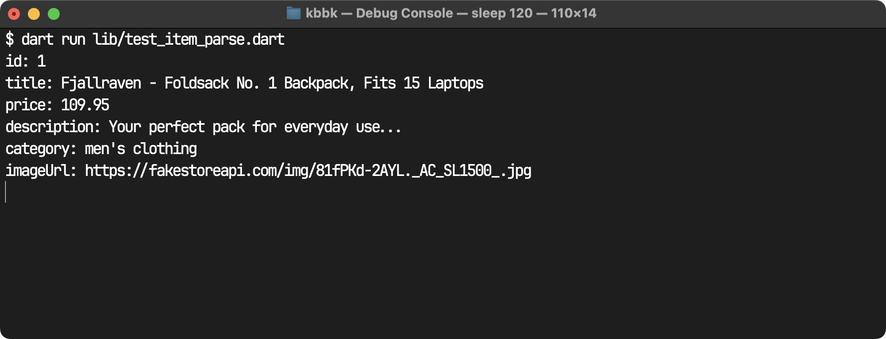

**ผลการรัน** `dart run lib/test_item_parse.dart`

```text
id: 1
title: Fjallraven - Foldsack No. 1 Backpack, Fits 15 Laptops
price: 109.95
description: Your perfect pack for everyday use...
category: men's clothing
imageUrl: https://fakestoreapi.com/img/81fPKd-2AYL._AC_SL1500_.jpg
```

ค่าทั้ง 6 ฟิลด์ตรงกับ JSON ตัวอย่าง รวมถึง `imageUrl` ที่ดึงมาจาก key `image` ได้ถูกต้อง
### ขั้นตอนที่ 7.3 — 🔧 ทำตาม (Interface) + 🧠 คิดเอง (Implementation)

ในสัปดาห์ก่อนหน้า มีการเรียนหลักการ **Repository Pattern** ไปแล้วว่า Widget/ViewModel ไม่ควรรู้จักแหล่งข้อมูลโดยตรง (เช่น เรียก `http.get()` เองในไฟล์ UI) แต่ควรรู้จักผ่าน **Interface** เท่านั้น เพื่อให้สลับแหล่งข้อมูลได้โดยไม่ต้องแก้ Widget สัปดาห์นี้ Campus Marketplace มีแหล่งข้อมูลจริงให้ดึง (REST API) ซึ่งจะนำทฤษฎีเรื่อง Repository Pattern มาใช้งานจริง

**🔧 ทำตามขั้นตอน** — สร้าง Interface ในไฟล์ `lib/repositories/item_repository.dart` ตามนี้ (สังเกตว่าต้อง `import` โมเดล `Item` เข้ามาด้วย เพราะ interface นี้อ้างถึง `Item` ในเมธอด `getItems()`):

```dart
import '../models/item.dart';

abstract class ItemRepository {
  Future<List<Item>> getItems();
}
```

**🧠 คิดเอง/ออกแบบเอง** — สร้างไฟล์ `lib/repositories/item_repository_api.dart` แล้วเขียน `ItemRepositoryApi implements ItemRepository` ต่อจากโครงเริ่มต้นด้านล่าง (มีส่วนเรียก API พร้อม timeout ให้เป็นตัวอย่าง คล้ายกับ `WeatherService` ที่เขียนเองแล้วในขั้นตอนที่ 2.3 — ปรับ endpoint เป็น `https://fakestoreapi.com/products` และแปลงผลลัพธ์เป็น `Future<List<Item>>` ด้วยรูปแบบ `.map().toList()` ตามบทเรียนหัวข้อ 6.5)

```dart
import 'dart:async';
import 'dart:convert';
import 'package:http/http.dart' as http;
import '../models/item.dart';
import 'item_repository.dart';

class ItemRepositoryApi implements ItemRepository {
  static const _baseUrl = 'https://fakestoreapi.com/products';

  @override
  Future<List<Item>> getItems() async {
    final uri = Uri.parse(_baseUrl);

    try {
      final response = await http.get(uri).timeout(const Duration(seconds: 10));

      if (response.statusCode == 200) {
        // ตัวอย่าง: แปลงข้อมูล List ของ JSON เป็น List<Item>
        final List<dynamic> data = jsonDecode(response.body);
        return data.map((e) => Item.fromJson(e as Map<String, dynamic>)).toList();
      }
      throw Exception('ไม่สามารถโหลดรายการสินค้าได้ (สถานะ ${response.statusCode})');
    } on TimeoutException {
      // ตัวอย่าง
      throw Exception('การเชื่อมต่อหมดเวลา กรุณาลองใหม่อีกครั้ง');
    } on http.ClientException {
      // ตัวอย่าง: ดักจับกรณีเชื่อมต่อเซิร์ฟเวอร์ไม่ได้เลย
      throw Exception('ไม่สามารถเชื่อมต่ออินเทอร์เน็ตได้ กรุณาตรวจสอบการเชื่อมต่อ');
    } catch (e) {
      // TODO: ดักจับ FormatException แยกต่างหาก (on FormatException) สำหรับกรณี JSON ผิดรูปแบบ
      // แล้ว throw Exception ข้อความภาษาไทยที่อ่านเข้าใจง่าย
      rethrow;
    }
  }
}
```

### ขั้นตอนที่ 7.4 — 🧠 คิดเอง/ออกแบบเอง

แก้ไขหน้า `HomePage` ให้รับ `ItemRepository` เข้ามาทาง Constructor แทนการสร้าง `ItemRepositoryApi()` ขึ้นมาเองภายในหน้าจอ ตามหลัก Dependency Injection ที่เรียนไปแล้วในสัปดาห์ก่อนหน้านี้

⚠️ **อย่าคัดลอกโครงเริ่มต้นด้านล่างไปวางทับไฟล์ `home_page.dart` เดิมทั้งหมด** เพราะโครงนี้แสดงเฉพาะส่วนที่เปลี่ยนแปลง (Constructor รับ `repository` + `FutureBuilder`) เท่านั้น ส่วน `AppBar` ที่มีไอคอนตะกร้า (`context.watch<CartModel>().itemCount`), ปุ่มไปหน้า `CheckoutPage`, และปุ่ม "เพิ่มลงตะกร้า" ต่อสินค้าแต่ละชิ้น (`context.read<CartModel>().add(...)`) ที่เขียนไว้แล้วในสัปดาห์ที่แล้ว **ต้องคงไว้ให้ครบ** เพียงแต่เปลี่ยนแหล่งข้อมูลสินค้าจาก List ตายตัวเป็นผลลัพธ์จาก `FutureBuilder` แทน

โครงเริ่มต้นด้านล่างมี Constructor และการเรียก `widget.repository.getItems()` ใน `initState()` ให้เป็นตัวอย่าง พร้อมตัวอย่าง `AppBar` ที่คงไอคอนตะกร้าและปุ่มไป Checkout จากสัปดาห์ที่แล้ว ไว้ให้ครบ ส่วนการจัดการ 3 สถานะ Loading/Success/Error ภายใน `FutureBuilder` และปุ่ม "เพิ่มลงตะกร้า" ต่อรายการสินค้า ให้ออกแบบและเขียนต่อเองโดยใช้รูปแบบเดียวกับที่ทำไว้แล้วใน `WeatherSearchPage` (ขั้นตอนที่ 2.4) และ `ProductCard`

⚠️ **จุดสำคัญเรื่อง import** ตัวอย่าง import ด้านล่างสมมติว่า `home_page.dart` อยู่ตำแหน่งเดียวกับที่สัปดาห์แล้ว วางไว้ คือ **อยู่ตรงใต้ `lib/`** (ระดับเดียวกับโฟลเดอร์ `models/` และ `repositories/` ไม่ได้อยู่ใน `lib/screens/`) ถ้าโปรเจกต์ของนักศึกษาวางไฟล์นี้ไว้คนละตำแหน่ง ให้ปรับ path ให้ตรงกับตำแหน่งไฟล์จริง (เช่น ถ้าย้าย `home_page.dart` ไปไว้ใน `lib/screens/` จริง ต้องเปลี่ยนกลับไปใช้ `../models/...` และ `../repositories/...` แทน) — **ทั้ง `Item` และ `ItemRepository` ต้อง import เข้ามาด้วยเสมอ** มิฉะนั้นจะเจอ error `The name 'Item' isn't a type` หรือ `'ItemRepository' isn't a type` ทันที

```dart
import 'package:provider/provider.dart';
import 'models/item.dart'; // Item model จากขั้นตอนที่ 7.2
import 'models/cart_model.dart'; // CartModel เดิมจากสัปดาห์ที่ 5
import 'repositories/item_repository.dart'; // ItemRepository (Interface) จากขั้นตอนที่ 7.3
import 'checkout_page.dart'; // CheckoutPage เดิมจากสัปดาห์ที่ 5

class HomePage extends StatefulWidget {
  final ItemRepository repository;
  const HomePage({super.key, required this.repository});

  @override
  State<HomePage> createState() => _HomePageState();
}

class _HomePageState extends State<HomePage> {
  late Future<List<Item>> _itemsFuture;

  @override
  void initState() {
    super.initState();
    _itemsFuture = widget.repository.getItems();
  }

  @override
  Widget build(BuildContext context) {
    return Scaffold(
      appBar: AppBar(
        title: const Text('Campus Marketplace'),
        // ตัวอย่าง: คงไอคอนตะกร้าจากสัปดาห์ที่ 5 ไว้ (ทำงานได้แล้ว ไม่ต้องแก้)
        actions: [
          IconButton(
            icon: Badge(
              label: Text('${context.watch<CartModel>().itemCount}'),
              child: const Icon(Icons.shopping_cart),
            ),
            onPressed: () => Navigator.push(
              context,
              MaterialPageRoute(builder: (_) => const CheckoutPage()),
            ),
          ),
        ],
      ),
      body: FutureBuilder<List<Item>>(
        future: _itemsFuture,
        builder: (context, snapshot) {
          if (snapshot.connectionState == ConnectionState.waiting) {
            // ตัวอย่าง: สถานะกำลังโหลด
            return const Center(child: CircularProgressIndicator());
          }
          if (snapshot.hasError) {
            // ตัวอย่าง: สถานะผิดพลาด
            return Center(child: Text('เกิดข้อผิดพลาด: ${snapshot.error}'));
          }
          // TODO: กรณี snapshot.hasData ให้แสดงรายการสินค้าด้วย ListView.builder
          // จาก snapshot.data! (เป็น List<Item>) โดยแต่ละแถวต้องมีปุ่ม "เพิ่มลงตะกร้า"
          // ที่เรียก context.read<CartModel>().add(item) แบบเดียวกับปุ่มใน ProductCard
          // เดิมจากสัปดาห์ที่ 5 ขั้นตอนที่ 2.4 (ปรับรับ Item แทน Product)
          return const SizedBox.shrink();
        },
      ),
    );
  }
}
```

ปรับ `HomePage(repository: ItemRepositoryApi())` ในจุดที่สร้าง `HomePage` จริง (`main.dart` หรือ Router) และตรวจว่า `CartModel` (`ChangeNotifierProvider` ที่ครอบแอปไว้จากสัปดาห์ที่แล้ว กับ `CheckoutPage`  ยังทำงานได้ตามปกติกับข้อมูล `Item` ที่ดึงมาจาก Repository (ปรับ Type จาก `Product` เป็น `Item` ในทุกจุดที่เกี่ยวข้อง เช่นใน `CartModel` และ `CheckoutPage`)

> ✅ **Checkpoint 7.3** รันแอปแล้วถ่ายภาพหน้าจอ Home ที่แสดงรายการสินค้าจริงจาก Fake Store API ผ่าน `ItemRepositoryApi` (ไม่ใช่ข้อมูล mock up) พร้อมภาพโครงสร้างไฟล์ที่แสดงให้เห็นว่ามีทั้ง `item_repository.dart` (Interface) และ `item_repository_api.dart` (Impl) แยกกันชัดเจน และทดสอบว่าปุ่ม "เพิ่มลงตะกร้า" กับการกดไปหน้า `CheckoutPage` จากสัปดาห์ที่ 5 ยังทำงานได้ปกติกับข้อมูล `Item` ชุดใหม่นี้ 

> ⚠️ **หมายเหตุ:** ช่วงที่ทำใบงาน (6–7 ต.ค. 2026) `fakestoreapi.com` ล่ม ตอบ `521` ต่อเนื่องหลายชั่วโมง แอปจึงแสดงหน้า error ตามที่ออกแบบไว้ (ภาพด้านล่าง) จึงเปลี่ยน `ItemRepositoryApi` ไปใช้ `https://dummyjson.com/products?limit=20` ซึ่งเป็น Public API ฟรีที่ฟิลด์ใกล้เคียงกัน ต่างกันแค่ห่อ List ไว้ใน key `products` และใช้ `thumbnail` แทน `image` — **แก้แค่ `item_repository_api.dart` กับ `Item.fromJson` เท่านั้น ไม่ต้องแตะ `HomePage` หรือ UI ใด ๆ เลย** ซึ่งเป็นข้อดีของ Repository Pattern ที่เห็นได้จริง
>
> 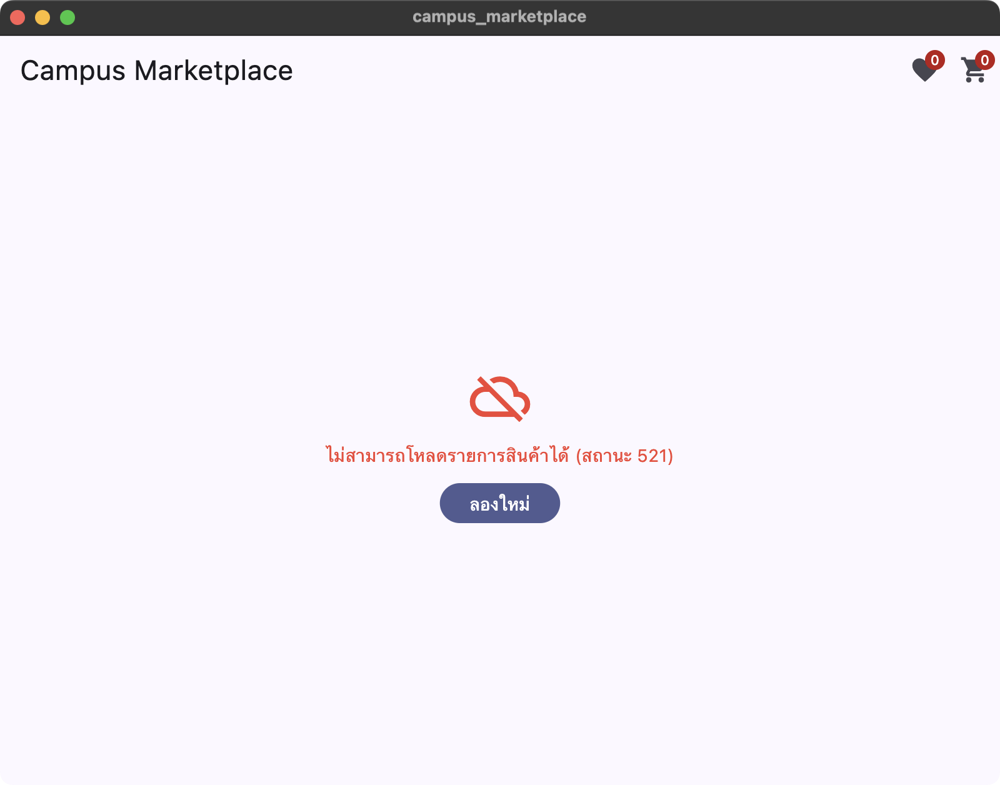

โค้ดส่วนที่แก้ใน `item_repository_api.dart`

```dart
  // fakestoreapi.com ล่ม (ตอบ 521 ต่อเนื่องหลายชั่วโมง ณ 6-7 ต.ค. 2026) จึงใช้ DummyJSON แทน
  static const _baseUrl = 'https://dummyjson.com/products?limit=20';
  ...
      if (response.statusCode == 200) {
        final body = jsonDecode(response.body) as Map<String, dynamic>;
        final List<dynamic> data = body['products'] as List<dynamic>;
        return data.map((e) => Item.fromJson(e as Map<String, dynamic>)).toList();
      }
  ...
    } on FormatException {
      throw Exception('ข้อมูลสินค้าที่ได้รับไม่ถูกต้อง กรุณาลองใหม่อีกครั้ง');
    }
```

**หน้า Home แสดงสินค้าจริงจาก API** — กด "เพิ่มลงตะกร้า" 2 ชิ้นแล้ว ไอคอนตะกร้าขึ้นเลข 2 พร้อม SnackBar ยืนยัน (และกดถูกใจ 1 ชิ้น ไอคอนหัวใจขึ้นเลข 1)

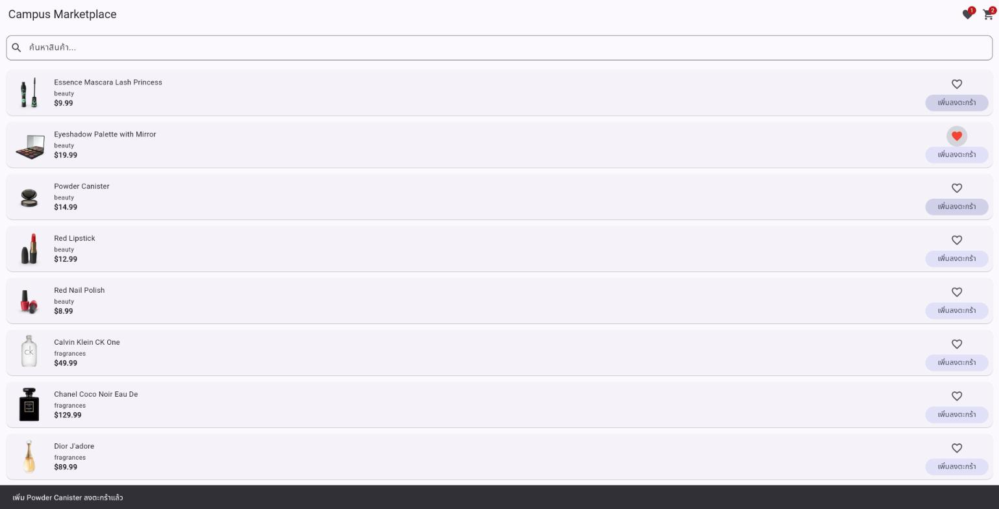

**หน้า CheckoutPage** แสดงสินค้า 2 ชิ้นที่เพิ่มไว้ พร้อมยอดรวม `$24.98`

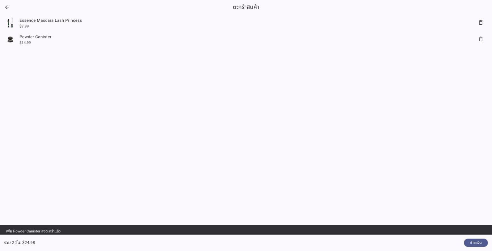

**โครงสร้างไฟล์** มีทั้ง `item_repository.dart` (Interface) และ `item_repository_api.dart` (Implementation) แยกกัน

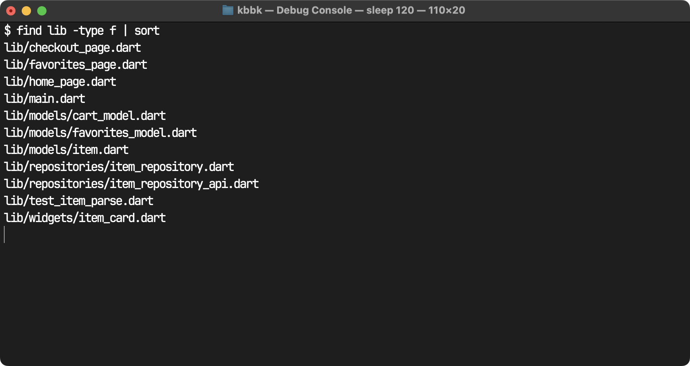

นอกจากนี้เขียน Widget Test (`test/widget_test.dart`) ที่ส่ง `FakeItemRepository` เข้าไปแทน API จริง เพื่อทดสอบว่า `HomePage` แสดงสินค้าและเพิ่มลงตะกร้าได้ และแสดงข้อความ error เมื่อ Repository โยน Exception — ผ่านทั้ง 2 เทสต์ (`flutter test`)

---


อย่าลืมให้เข้าไปทำ **[Quiz Chapter 6]** บน Moodle และควรอ่านทำความเข้าใจทฤษฎีก่อน ไม่ใช่แค่เข้าไปกดทำแบบทดสอบ เพื่อรอดูเฉลยเพียงอย่างเดียว

